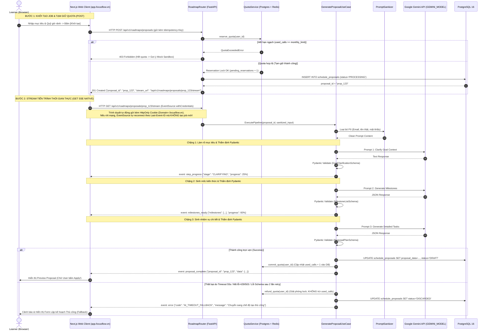
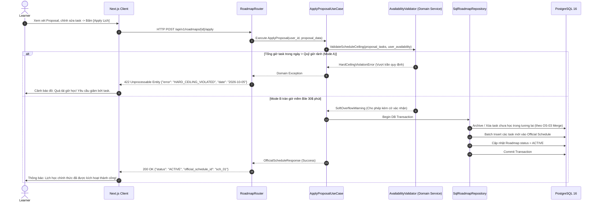
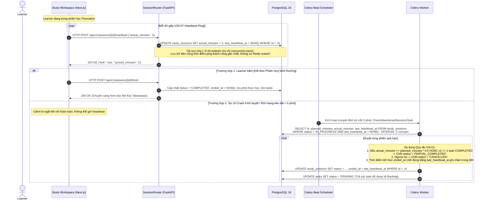

# FocusFlow — Thiết kế Kiến trúc Tổng thể & Phân lớp Hệ thống (System Architecture Document)
## Phiên bản: v1.0 — Chuẩn Kiến trúc Cơ sở (Architecture Baseline)
**Dự án:** FocusFlow — Hệ thống hỗ trợ lập kế hoạch và thực thi lộ trình tự học thích ứng tích hợp AI  
**Tiêu chuẩn kỹ thuật:** ISO/IEC/IEEE 42010 (Systems and software engineering — Architecture description), UML 2.5  
**Căn cứ đánh giá học thuật:** Khung Rubric Đồ án Tốt nghiệp CNTT — Tiêu chí TC2.1 & TC2.3 (Mức 5)  
**Tài liệu liên kết:** [`docs/srs/srs-v1.0.md`](file:///Users/vuthang/Documents/FocusFlow/docs/srs/srs-v1.0.md), [`docs/decisions/`](file:///Users/vuthang/Documents/FocusFlow/docs/decisions)

---

## MỤC LỤC

1. [Tổng quan & Các Động lực Kiến trúc (Architecture Drivers)](#1-tổng-quan--các-động-lực-kiến-trúc-architecture-drivers)
   - 1.1 [Bối cảnh kỹ thuật](#11-bối-cảnh-kỹ-thuật)
   - 1.2 [Các ràng buộc cốt lõi (Constraints)](#12-các-ràng-buộc-cốt-lõi-constraints)
   - 1.3 [Thuộc tính chất lượng định lượng (NFR Mapping)](#13-thuộc-tính-chất-lượng-định-lượng-nfr-mapping)
2. [Lựa chọn Phong cách Kiến trúc & Phân tích Đánh đổi (Architectural Style & Trade-Offs)](#2-lựa-chọn-phong-cách-kiến-trúc--phân-tích-đánh-đổi-architectural-style--trade-offs)
   - 2.1 [Các phương án kiến trúc ứng viên](#21-các-phương-án-kiến-trúc-ứng-viên)
   - 2.2 [Bảng so sánh đánh đổi (Trade-off Analysis)](#22-bảng-so-sánh-đánh-đổi-trade-off-analysis)
   - 2.3 [Quyết định kiến trúc lựa chọn](#23-quyết-định-kiến-trúc-lựa-chọn)
3. [Mô hình Ngữ cảnh Hệ thống (C4 Context Model)](#3-mô-hình-ngữ-cảnh-hệ-thống-c4-context-model)
4. [Mô hình Vùng chứa & Phân bổ Công nghệ (C4 Container & Tech Stack Rationale)](#4-mô-hình-vùng-chứa--phân-bổ-công-nghệ-c4-container--tech-stack-rationale)
   - 4.1 [Sơ đồ C4 Container](#41-sơ-đồ-c4-container)
   - 4.2 [Luận cứ lựa chọn công nghệ (Tech Stack Rationale)](#42-luận-cứ-lựa-chọn-công-nghệ-tech-stack-rationale)
5. [Thiết kế Phân lớp Chi tiết (Hexagonal / Clean Architecture Deep-Dive)](#5-thiết-kế-phân-lớp-chi-tiết-hexagonal--clean-architecture-deep-dive)
   - 5.1 [Quy tắc Phụ thuộc (The Dependency Rule)](#51-quy-tắc-phụ-thuộc-the-dependency-rule)
   - 5.2 [Cấu trúc cây thư mục Backend tiêu chuẩn](#52-cấu-trúc-cây-thư-mục-backend-tiêu-chuẩn)
   - 5.3 [Đặc tả 4 tầng kiến trúc (Domain, Application, Infrastructure, Presentation)](#53-đặc-tả-4-tầng-kiến-trúc-domain-application-infrastructure-presentation)
   - 5.4 [Hệ thống Cổng & Bộ điều hợp (Ports & Adapters Specification)](#54-hệ-thống-cổng--bộ-điều-hợp-ports--adapters-specification)
6. [Luồng Dữ liệu & Động lực Học Hệ thống (Data Flow & Dynamic Behavior)](#6-luồng-dữ-liệu--động-lực-học-hệ-thống-data-flow--dynamic-behavior)
   - 6.1 [Luồng Phân rã Mục tiêu AI qua SSE (FR-PLAN-001..003)](#61-luồng-phân-rã-mục-tiêu-ai-qua-sse-fr-plan-001003)
   - 6.2 [Luồng Thẩm định Backend Hard Ceiling & Strict Apply (BUSR-02, BUSR-03)](#62-luồng-thẩm-định-backend-hard-ceiling--strict-apply-busr-02-busr-03)
   - 6.3 [Luồng Tạm dừng Lộ trình & Tịnh tiến Tất định Domino Shift (BUSR-07)](#63-luồng-tạm-dừng-lộ-trình--tịnh-tiến-tất-định-domino-shift-busr-07)
   - 6.4 [Luồng Đồng bộ Phiên học Heartbeat & Quét Timeout (BUSR-09, OS-07)](#64-luồng-đồng-bộ-phiên-học-heartbeat--quét-timeout-busr-09-os-07)
7. [Kiến trúc Bảo mật & Ranh giới Tin cậy (Security Architecture & Trust Boundaries)](#7-kiến-trúc-bảo-mật--ranh-giới-tin-cậy-security-architecture--trust-boundaries)
   - 7.1 [Xác thực & Quản trị Phiên (Auth & JWT Lifecycle)](#71-xác-thực--quản-trị-phiên-auth--jwt-lifecycle)
   - 7.2 [Bảo mật Luồng Lịch Ngoại vi 1 Chiều WebCal (RFC 5545)](#72-bảo-mật-luồng-lịch-ngoại-vi-1-chiều-webcal-rfc-5545)
   - 7.3 [Kiểm soát Hạn ngạch & Phòng chống Cạn kiệt AI (Quota Middleware)](#73-kiểm-soát-hạn-ngạch--phòng-chống-cạn-kiệt-ai-quota-middleware)
   - 7.4 [Vệ sinh Dữ liệu & Bảo mật Bí mật (Data Hygiene & Zero Secret Leak)](#74-vệ-sinh-dữ-liệu--bảo-mật-bí-mật-data-hygiene--zero-secret-leak)
8. [Kiến trúc Triển khai & Vận hành (Deployment & Operational Architecture)](#8-kiến-trúc-triển-khai--vận-hành-deployment--operational-architecture)
   - 8.1 [Mô hình Hybrid: Docker Compose Local & Cloud PaaS UAT](#81-mô-hình-hybrid-docker-compose-local--cloud-paas-uat)
   - 8.2 [Sơ đồ Cấu hình Docker Compose đa vùng chứa](#82-sơ-đồ-cấu-hình-docker-compose-đa-vùng-chứa)
   - 8.3 [Chiến lược Giám sát & Nhật ký (Monitoring, Health Check, Flower)](#83-chiến-lược-giám-sát--nhật-ký-monitoring-health-check-flower)
9. [Kế hoạch Chuyển tiếp & Liên kết Hồ sơ Kỹ thuật](#9-kế-hoạch-chuyển-tiếp--liên-kết-hồ-sơ-kỹ-thuật)

---

## 1. Tổng quan & Các Động lực Kiến trúc (Architecture Drivers)

### 1.1. Bối cảnh kỹ thuật
FocusFlow giải quyết bài toán cốt tử của người tự học công nghệ: Tự động hóa phân rã lộ trình bằng AI nhưng duy trì sự kiểm soát chặt chẽ của con người (Human-in-the-loop); tập trung hóa không gian thực thi (Study Workspace); và thích ứng linh hoạt trước biến cố đời sống bằng giải thuật tất định Domino Shift. 

Hệ thống đòi hỏi sự cân bằng nghiêm ngặt giữa:
1. **Năng lực xử lý AI không đồng bộ (AI Non-blocking Execution):** Các mô hình ngôn ngữ lớn (LLM) phản hồi trễ từ vài giây đến 40 giây. Kiến trúc phải phản hồi liên tục, không gây đứt gãy kết nối mạng hoặc chặn luồng (blocking).
2. **Tính Toàn vẹn Dữ liệu & Quy tắc Nghiệp vụ Nghiêm ngặt (Strict Business Invariants):** Không được để AI tự ý ghi đè lịch chính thức; không cho phép task học vượt quá quỹ thời gian rảnh đã cam kết (Hard Ceiling Gate); đảm bảo tính nhất quán 100% khi dời lịch tịnh tiến.
3. **Môi trường Đồ án Tốt nghiệp & Nguồn lực Đội ngũ:** Đội ngũ gồm 2 sinh viên chuyên ngành Công nghệ Phần mềm. Kiến trúc phải đảm bảo tính phân tách độc lập (Separation of Concerns) để chia việc song song, chuẩn mực học thuật cao để bảo vệ trước Hội đồng, đồng thời tránh bẫy "phức tạp hóa không cần thiết" (Over-engineering).

### 1.2. Các ràng buộc cốt lõi (Constraints)
* **CON-01 (Thời gian & Nhân lực):** Hoàn thành toàn bộ phân tích, thiết kế, hiện thực và kiểm thử UAT trong vòng 15 tuần theo WBS Gantt Chart.
* **CON-02 (Ngân sách Vận hành):** Ngân sách gọi API LLM và hạ tầng máy chủ giới hạn ở mức sinh viên. Bắt buộc có cơ chế quản trị hạn ngạch (Quota Guard) và Mock Sandbox.
* **CON-03 (Bảo mật Khóa API):** Tuyệt đối không để lộ API Key của Gemini/OpenAI phía client (Zero Secret Leak).
* **CON-04 (Môi trường Nghiệm thu Đa dạng):** Hệ thống phải chạy được mượt mà trên máy trạm cục bộ của Hội đồng chấm thi (Local Offline/Docker) và triển khai được trên Internet phục vụ UAT người dùng thật (Cloud PaaS).

### 1.3. Thuộc tính chất lượng định lượng (NFR Mapping)
Hệ thống kiến trúc được thiết kế nhằm thỏa mãn trực tiếp 5 nhóm yêu cầu phi chức năng (NFR) từ SRS v1.0:

| Mã NFR | Thuộc tính Chất lượng | Chỉ số Định lượng Ràng buộc | Giải pháp Kiến trúc Tương ứng |
|---|---|---|---|
| **NFR-PERF-001** | Hiệu năng Tương tác AI | Hard Timeout 55s; Không treo UI trình duyệt | Sử dụng **Server-Sent Events (SSE)** truyền dữ liệu luồng; thiết lập `asyncio.wait_for(timeout=55.0)`. |
| **NFR-PERF-002** | Độ trễ API Backend | Thao tác UI $\le 500$ms; API phản hồi $\le 200$ms (20 concurrent users) | **FastAPI** bất đồng bộ (`asyncpg`), đánh chỉ mục B-Tree cơ sở dữ liệu PostgreSQL, đệm Redis cho Quota/Session. |
| **NFR-SEC-001..004** | An toàn & Bảo mật | 0 rò rỉ secret; Argon2id; WebCal Token 32-byte hex; Che giấu token khỏi log | Tách biệt hoàn toàn Backend/Frontend qua mạng; Middleware làm sạch log truy cập; Cookie HttpOnly/SameSite. |
| **NFR-AVAIL-001** | Độ sẵn sàng Hệ thống | Uptime $\ge 95\%$ trong đợt thử nghiệm | **Celery Worker** cô lập các tác vụ nặng; Celery Beat tự động phục hồi phiên gián đoạn; Health check container. |
| **NFR-UX-001..002** | Trải nghiệm & Tiếp cận | Responsive Mobile/Desktop; Lighthouse Accessibility $\ge 90$ | **Next.js 15 (App Router)** kết hợp TailwindCSS và Radix UI / Shadcn UI; phân tách Server/Client Components. |

---

## 2. Lựa chọn Phong cách Kiến trúc & Phân tích Đánh đổi (Architectural Style & Trade-Offs)

### 2.1. Các phương án kiến trúc ứng viên
Nhóm thiết kế xem xét 3 phương án phong cách kiến trúc tiềm năng:

1. **Phương án 1 — Full-stack Monolith (Next.js App Router duy nhất):**
   * *Mô tả:* Dùng Next.js cho cả giao diện, Server Actions và Route Handlers; kết nối trực tiếp PostgreSQL qua Prisma ORM; gọi LLM trực tiếp trong Server Actions.
2. **Phương án 2 — Microservices Architecture:**
   * *Mô tả:* Tách riêng từng service độc lập: User/Auth Service, Plan/AI Service, Study Session Service, Calendar Service, Notification Service; giao tiếp qua gRPC và RabbitMQ/Kafka.
3. **Phương án 3 — Modular Monolith với Kiến trúc Lục giác (Hexagonal / Clean Architecture):**
   * *Mô tả:* Tách biệt ứng dụng Web Frontend (Next.js) và Backend API (Python/FastAPI). Phía Backend áp dụng mô hình Ports & Adapters (Kiến trúc Lục giác): Lớp Domain trung tâm không phụ thuộc bất kỳ thư viện ngoài nào; Use Cases đóng gói logic ứng dụng; Cơ sở dữ liệu và LLM nằm ở lớp Adapter bên ngoài.

### 2.2. Bảng so sánh đánh đổi (Trade-off Analysis)

| Tiêu chí So sánh (Trọng số) | PA 1: Full-stack Next.js Monolith | PA 2: Microservices Architecture | PA 3: Hexagonal Modular Monolith (Đề xuất) |
|---|---|---|---|
| **Khả năng kiểm thử nghiệp vụ độc lập (High)** | Trung bình (Dính chặt vào Next.js runtime và Server Actions context) | Cao (Nhưng kiểm thử tích hợp End-to-End rất phức tạp) | **Xuất sắc (Lớp Domain độc lập 100%, kiểm thử Unit Test không cần mock DB/mạng)** |
| **Tận dụng Hệ sinh thái AI / Data (High)** | Thấp (TypeScript SDK cho AI còn phân mảnh, khó tối ưu xử lý dữ liệu phức tạp) | Cao (Có thể dùng Python cho AI Service) | **Tối đa (FastAPI & Pydantic v2 là tiêu chuẩn vàng xử lý AI, JSON Schema và Async IO)** |
| **Độ phức tạp Vận hành & DevOps (High)** | Rất thấp (1 container duy nhất) | Cực kỳ cao (Nhiều repo, Docker orchestration, distributed tracing, network failure) | **Thấp – Trung bình (Đóng gói 1 file Docker Compose hoàn chỉnh, triển khai dễ dàng)** |
| **Phân định Ranh giới & Chia việc Đồ án (Medium)** | Khá (Dễ bị giẫm chân nhau giữa code UI và code Database) | Rất tốt (Nhưng overhead giao tiếp API quá lớn) | **Tối ưu (1 sinh viên Lead Frontend/Next.js, 1 sinh viên Lead Backend/FastAPI/AI qua REST/OpenAPI)** |
| **Bảo vệ Tính Học thuật trước Hội đồng (High)** | Trung bình (Bị xem là "Web CRUD Next.js thông thường") | Rủi ro (Hội đồng sẽ chất vấn lý do chọn Microservices khi tải chỉ 20 users) | **Xuất sắc (Chứng minh năng lực áp dụng chuẩn mực Clean Architecture, Ports & Adapters theo Martin Fowler & Uncle Bob)** |

### 2.3. Quyết định kiến trúc lựa chọn
> [!IMPORTANT]
> **QUYẾT ĐỊNH CHÍNH THỨC (ADR-001):**  
> Dự án FocusFlow lựa chọn **Phương án 3: Modular Monolith kết hợp Kiến trúc Lục giác (Hexagonal Architecture / Ports & Adapters)** cho tầng Backend và tách biệt Web Frontend bằng **Next.js 15 App Router**.  
> **Lý do cốt lõi:** Bảo vệ tính toàn vẹn của các quy tắc nghiệp vụ quan trọng (Domino Shift, Soft Overflow, Strict Apply) bên trong Domain thuần túy; khai thác sức mạnh tối thượng của Python và Pydantic trong tích hợp AI; triệt tiêu hoàn toàn rủi ro vận hành phân tán của Microservices; và tối ưu hóa sự phối hợp song song của 2 sinh viên trong đồ án tốt nghiệp.

---

## 3. Mô hình Ngữ cảnh Hệ thống (C4 Context Model)

Sơ đồ C4 Context minh họa ranh giới rạch ròi giữa người dùng, hệ thống FocusFlow và các hệ thống dịch vụ ngoại vi:

```mermaid
flowchart TD
    User["Learner / Người học<br>[Person]<br>Sinh viên, người chuyển ngành, ôn chứng chỉ"]
    Admin["Administrator<br>[Person - Service Role]<br>Quản trị viên hạ tầng & cấu hình hạn ngạch"]
    
    subgraph Boundary["FocusFlow System Boundary"]
        FocusFlow["FocusFlow Platform<br>[Software System]<br>Lập kế hoạch & thực thi lộ trình tự học thích ứng tích hợp AI"]
    end
    
    LLM["External LLM Provider<br>[External System]<br>Google Gemini API<br>(Cấu hình qua GEMINI_MODEL, dự phòng OpenAI)"]
    ExtCal["External Calendar Applications<br>[External System]<br>Google Calendar, Apple Calendar, Outlook<br>(Định dạng iCalendar RFC 5545)"]

    User -->|1. Thiết lập mục tiêu, duyệt lịch, học tập Workspace| FocusFlow
    Admin -->|Quản trị token quota, giám sát hạ tầng| FocusFlow
    FocusFlow -->|2. Gửi sanitized prompt, nhận JSON schema| LLM
    ExtCal -->|3. Kéo lịch học 1 chiều qua URL WebCal bí mật (.ics)| FocusFlow
```

---

## 4. Mô hình Vùng chứa & Phân bổ Công nghệ (C4 Container & Tech Stack Rationale)

### 4.1. Sơ đồ C4 Container
Hệ thống FocusFlow gồm 6 vùng chứa (Containers) logic, giao tiếp thông qua các giao thức mạng tiêu chuẩn:

```mermaid
flowchart TB
    UserBrowser["Web Browser (Client Device)<br>[Desktop / Mobile]"]
    ExtCalApp["Calendar Apps (External)<br>[Google / Apple Calendar]"]
    LLMService["Google Gemini API<br>[External SaaS - GEMINI_MODEL]"]

    subgraph ContainerSystem["FocusFlow Container Environment"]
        WebFrontend["Web Frontend Container<br>[Next.js 15, React 19, TypeScript]<br>App Router, Tailwind CSS, Shadcn UI, Zustand"]
        BackendAPI["Backend API Container<br>[FastAPI, Python 3.12]<br>Clean / Hexagonal Architecture Core Engine"]
        CeleryWorker["Worker Queue Container<br>[Celery, Python 3.12]<br>Xử lý tác vụ nền nặng & tổng hợp dữ liệu"]
        CeleryBeat["Scheduler Container<br>[Celery Beat]<br>Kích hoạt cronjob định kỳ"]
        RedisStore["In-Memory Cache & Broker<br>[Redis 7 Alpine]<br>Message Broker, Quota Atomic Guard, Heartbeat Cache"]
        PostgresDB["Primary Relational Database<br>[PostgreSQL 16 Alpine]<br>Lưu trữ bền vững 14 thực thể miền (Domain Data)"]
    end

    UserBrowser -->|HTTPS / SSE<br>JSON API| WebFrontend
    WebFrontend -->|REST API Calls & SSE Proxy<br>JSON / HTTP/2| BackendAPI
    ExtCalApp -->|HTTP GET /api/v1/calendar/feed/{token}.ics<br>RFC 5545 iCalendar| BackendAPI
    
    BackendAPI -->|Async Read/Write (SQLAlchemy 2.0 / asyncpg)| PostgresDB
    BackendAPI -->|Atomic Quota Check & Caching (redis-py)| RedisStore
    BackendAPI -->|Dispatch Async Tasks (celery.send_task)| RedisStore
    
    CeleryBeat -->|Schedule Periodic Tasks| RedisStore
    RedisStore -->|Fetch Task Queue| CeleryWorker
    CeleryWorker -->|Batch Updates & Status Resolution| PostgresDB
    
    BackendAPI -->|HTTPS POST (Prompt -> JSON Schema)<br>Hard Timeout 55s| LLMService
    CeleryWorker -.->|Async AI Periodic Review (nếu có)| LLMService
```

### 4.2. Luận cứ lựa chọn công nghệ (Tech Stack Rationale)

#### 1. Frontend: Next.js 15 (App Router) + React 19 + TypeScript
* **Lý do lựa chọn:**
  * **App Router & Server Components:** Tối ưu hóa tải trang lần đầu (First Contentful Paint), render SEO-friendly cho các trang giới thiệu, đồng thời hỗ trợ Client Components cho không gian học tương tác cao (Study Workspace).
  * **TypeScript & TailwindCSS:** Định kiểu tĩnh an toàn, giảm thiểu lỗi runtime; kết hợp bộ thư viện công thái học **Shadcn UI (Radix UI)** giúp ứng dụng đạt chuẩn tiếp cận **Google Lighthouse Accessibility $\ge 90$** theo đúng cam kết `NFR-UX-002`.
  * **Quản trị Trạng thái Phân tầng:**
    * **TanStack Query (React Query v5):** Quản lý toàn bộ Server State (caching lộ trình, tự động revalidate khi đổi trạng thái, xử lý optimistic updates).
    * **Zustand:** Thư viện quản lý Client State siêu nhẹ (~1KB), không boilerplate, chịu trách nhiệm lưu trạng thái cục bộ phiên học: bộ đếm Pomodoro/Stopwatch, nội dung nháp Scratchpad tức thời.

#### 2. Backend: Python 3.12 + FastAPI + Pydantic v2
* **Lý do lựa chọn:**
  * **Hệ sinh thái AI Tối thượng:** Python là trung tâm của toàn bộ nền kinh tế LLM hiện đại. Thư viện `google-genai` và `openai` trên Python luôn được ưu tiên cập nhật sớm nhất với độ ổn định cao nhất.
  * **Pydantic v2 (Rust Core):** Năng lực xác thực dữ liệu (Data Validation) cực nhanh bằng nhân Rust. Khả năng ép kiểu JSON đầu ra của AI vào các Schema cụ thể (`ProposalPlanSchema`, `MilestoneSchema`) đảm bảo 100% tuân thủ `NFR-AI-001`.
  * **Hiệu năng Bất đồng bộ Cao (Asyncio):** FastAPI hoạt động trên nền tảng ASGI (Uvicorn), xử lý hàng ngàn I/O-bound requests đồng thời mà không nghẽn luồng, đáp ứng hoàn hảo tiêu chí phản hồi API $\le 200$ms (`NFR-PERF-002`).

#### 3. Cơ sở dữ liệu: PostgreSQL 16
* **Lý do lựa chọn:** Hệ quản trị CSDL quan hệ mã nguồn mở mạnh mẽ nhất thế giới. Hỗ trợ chuẩn ACID tuyệt đối cho các giao dịch tài chính/quota; hỗ trợ kiểm tra ràng buộc toàn vẹn dữ liệu (Constraints, Foreign Keys); hỗ trợ kiểu dữ liệu `JSONB` linh hoạt cho cấu trúc bài học chi tiết và chỉ mục B-Tree / GIN hiệu năng cao.

#### 4. Đệm & Hàng đợi: Redis 7 + Celery + Celery Beat
* **Lý do lựa chọn:**
  * **Redis:** Lưu trữ bộ đếm Quota nguyên tử (Atomic Counter) ngăn chặn Race Condition khi gọi AI; lưu nhịp tim Heartbeat của phiên học với cơ chế tự hủy TTL (Time-To-Live).
  * **Celery & Celery Beat:** Đóng gói cơ chế Worker Queue tiêu chuẩn ngành, giải quyết triệt để các tác vụ định kỳ: Quét và chốt các phiên học bị gián đoạn quá 5 phút (`OS-07`), quét tác vụ quá hạn định kỳ nửa đêm, và tổng hợp báo cáo học tập tuần.

---

## 5. Thiết kế Phân lớp Chi tiết (Hexagonal / Clean Architecture Deep-Dive)

### 5.1. Quy tắc Phụ thuộc (The Dependency Rule)
Theo định đề của Robert C. Martin (Uncle Bob) và Alistair Cockburn:
> **Quy tắc Vàng:** Các tầng bên trong tuyệt đối KHÔNG ĐƯỢC PHỤ THUỘC vào bất kỳ thành phần nào của các tầng bên ngoài. Chiều mũi tên phụ thuộc mã nguồn luôn hướng TỪ NGOÀI VÀO TRONG (Inward Dependencies).

```
   [PRESENTATION / WEB CONTROLLERS]  (Tầng Ngoài cùng)
                 │
                 ▼
      [INFRASTRUCTURE ADAPTERS]      (Postgres, Redis, LLM)
                 │
                 ▼
       [APPLICATION USE CASES]       (Tầng Điều phối Ứng dụng)
                 │
                 ▼
          [DOMAIN ENTITIES]          (Tầng Lõi - Bất biến, Thuần khiết)
```

* **Domain Layer:** Chứa 100% mã Python thuần túy (Pure Python dataclasses, Entities, Value Objects, Domain Exceptions). Không chứa `import fastapi`, không chứa `import sqlalchemy`, không chứa `import redis`!
* **Application Layer:** Định nghĩa các ca sử dụng (Use Cases) điều phối luồng nghiệp vụ và khai báo các Cổng giao tiếp trừu tượng (Ports / Python Abstract Base Classes).
* **Infrastructure Layer:** Chứa mã nguồn cụ thể hiện thực hóa các Port: SQLAlchemy ORM models, Redis client, Google Gemini client.
* **Presentation Layer:** FastAPI Routers tiếp nhận HTTP Request, giải mã DTOs, kích hoạt Use Case và trả về HTTP Response.

### 5.2. Cấu trúc cây thư mục Backend tiêu chuẩn
Cấu trúc module hóa theo đúng chuẩn Ports & Adapters trong thư mục `backend/`:

```
backend/
├── src/
│   ├── domain/                         # TẦNG MIỀN (DOMAIN LAYER - CORE)
│   │   ├── exceptions/                 # Domain-specific exceptions
│   │   │   ├── business_rule_violation.py
│   │   │   └── quota_exceeded_error.py
│   │   ├── models/                     # Entities & Value Objects (Pure Python)
│   │   │   ├── user.py
│   │   │   ├── roadmap.py              # Logic trạng thái INITIALIZED -> ACTIVE -> PAUSED
│   │   │   ├── milestone.py
│   │   │   ├── task.py                 # Logic kiểm tra quá hạn tất định (date < TODAY)
│   │   │   ├── study_session.py        # Logic phân định PARTIAL vs CANCELLED (OS-01)
│   │   │   ├── availability.py         # Logic Hard Ceiling Mode A & Soft Overflow Mode B
│   │   │   └── quota.py
│   │   └── services/                   # Domain Services (Thuật toán lõi)
│   │       ├── domino_shift_calculator.py  # Thuật toán tịnh tiến lịch tất định (BUSR-07)
│   │       └── availability_validator.py   # Kiểm tra trần giờ rảnh (BUSR-03, BUSR-04)
│   │
│   ├── application/                    # TẦNG ỨNG DỤNG (APPLICATION LAYER)
│   │   ├── ports/                      # Cổng trừu tượng (Interfaces / Protocols)
│   │   │   ├── input/                  # Driving Ports (Use Case Interfaces)
│   │   │   │   ├── create_roadmap_use_case.py
│   │   │   │   ├── apply_proposal_use_case.py
│   │   │   │   ├── pause_roadmap_use_case.py
│   │   │   │   ├── track_session_use_case.py
│   │   │   │   └── export_calendar_use_case.py
│   │   │   └── output/                 # Driven Ports (Secondary Interfaces)
│   │   │       ├── repositories/       # Cổng Repository trừu tượng
│   │   │       │   ├── user_repository_port.py
│   │   │       │   ├── roadmap_repository_port.py
│   │   │       │   └── session_repository_port.py
│   │   │       ├── services/           # Cổng dịch vụ ngoại vi
│   │   │       │   ├── llm_provider_port.py      # Giao tiếp AI
│   │   │       │   ├── cache_port.py             # Caching & Session Store
│   │   │       │   └── quota_guard_port.py       # Quản trị hạn ngạch
│   │   ├── use_cases/                  # Hiện thực hóa các Use Case
│   │   │   ├── roadmap/
│   │   │   │   ├── generate_proposal_uc.py
│   │   │   │   ├── apply_proposal_uc.py
│   │   │   │   └── pause_roadmap_uc.py
│   │   │   └── session/
│   │   │       ├── start_session_uc.py
│   │   │       ├── sync_heartbeat_uc.py
│   │   │       └── finalize_session_uc.py
│   │   └── dtos/                       # Data Transfer Objects & Pydantic Schemas
│   │       ├── plan_request_dto.py
│   │       ├── proposal_response_dto.py
│   │       └── session_heartbeat_dto.py
│   │
│   ├── infrastructure/                 # TẦNG HẠ TẦNG (INFRASTRUCTURE ADAPTERS)
│   │   ├── database/                   # PostgreSQL Adapter
│   │   │   ├── connection.py           # Async SQLAlchemy Engine & SessionMaker
│   │   │   ├── orm_models/             # SQLAlchemy 2.0 ORM Mappings
│   │   │   └── repositories/           # Postgres Repositories (Implements Ports)
│   │   │       ├── sql_roadmap_repo.py
│   │   │       └── sql_session_repo.py
│   │   ├── external_ai/                # AI Adapters
│   │   │   ├── gemini_adapter.py       # Google Gemini SDK implementation
│   │   │   ├── openai_adapter.py       # OpenAI fallback implementation
│   │   │   ├── prompt_sanitizer.py     # Làm sạch prompt (NFR-SEC-003)
│   │   │   └── schemas/                # Strict JSON Schemas for LLM outputs
│   │   ├── caching/                    # Redis Adapter
│   │   │   ├── redis_client.py
│   │   │   ├── redis_quota_adapter.py  # Lua script atomic token bucket
│   │   │   └── redis_session_cache.py
│   │   ├── calendar/                   # iCalendar Adapter
│   │   │   └── ical_generator.py       # RFC 5545 generator
│   │   └── workers/                    # Celery Worker Tasks
│   │       ├── celery_app.py
│   │       └── tasks/
│   │           ├── timeout_cleanup_task.py   # Quét session mất mạng (OS-07)
│   │           └── weekly_summary_task.py    # Báo cáo học tập tuần
│   │
│   └── presentation/                   # TẦNG HIỂN THỊ (DRIVING ADAPTERS / API)
│       ├── api/
│       │   ├── v1/
│       │   │   ├── routers/
│       │   │   │   ├── auth_router.py
│       │   │   │   ├── roadmap_router.py     # Hỗ trợ SSE Streaming
│       │   │   │   ├── session_router.py     # Heartbeat & Finish
│       │   │   │   └── calendar_router.py    # Public WebCal endpoint
│       │   │   └── dependencies.py           # FastAPI Dependency Injection
│       │   └── middlewares/
│       │       ├── auth_middleware.py        # JWT extraction
│       │       ├── quota_guard_middleware.py # Chặn cạn kiệt AI
│       │       └── log_sanitizer_middleware.py # Che giấu WebCal token khỏi log
│       └── main.py                     # FastAPI Application Factory
```

### 5.3. Đặc tả 4 tầng kiến trúc
1. **Lớp Miền (Domain Layer):**
   * Bảo bọc các thực thể bất biến: `Roadmap`, `Milestone`, `Task`, `StudySession`, `AvailabilityProfile`, `PauseRecord`, `WebCalToken`.
   * Chứa đựng công thức toán học và logic suy diễn thuần túy: Thuật toán tịnh tiến dời lịch `Domino Shift` (tính toán số ngày dời dựa trên lịch nghỉ và quỹ giờ khả dụng); điều kiện suy diễn quá hạn `task.status != COMPLETED AND task.scheduled_date < TODAY` (`BUSR-06`).
2. **Lớp Ứng dụng (Application Layer):**
   * Đóng gói quy trình nghiệp vụ (Workflow Orchestration): Ví dụ trong `ApplyProposalUseCase`, lớp này kiểm tra tính hợp lệ qua `AvailabilityValidator` (Domain Service); nếu đạt, gọi `RoadmapRepositoryPort` để lưu vào DB trong một Database Transaction duy nhất; nếu không đạt, ném ra ngoại lệ `HardCeilingViolationError`.
3. **Lớp Hạ tầng (Infrastructure Layer):**
   * Hiện thực hóa chi tiết kỹ thuật: `GeminiAdapter` thực hiện gọi API Google Gemini với cơ chế Exponential Backoff với Full Jitter (`OS-08`) và ngắt cứng ở giây thứ 55 (`NFR-PERF-001`).
   * `SqlRoadmapRepository` thực hiện các câu truy vấn SQLAlchemy 2.0 Async, chuyển đổi giữa ORM Model và Domain Model qua Data Mappers.
4. **Lớp Trình bày (Presentation Layer):**
   * Tiếp nhận HTTP Requests từ người dùng hoặc hệ thống ngoài, định tuyến đến đúng Use Case thông qua FastAPI Dependency Injection (`Depends`), định dạng dữ liệu trả về theo đúng mã HTTP (200 OK, 201 Created, 400 Bad Request, 403 Quota Exceeded, 422 Unprocessable Entity).

### 5.4. Hệ thống Cổng & Bộ điều hợp (Ports & Adapters Specification)

Bảng ánh xạ các Cổng (Ports) và Bộ điều hợp (Adapters) chi tiết:

| Tên Cổng (Port Interface) | Loại Cổng | Vị trí Khai báo | Bộ điều hợp Hiện thực (Adapter) | Trách nhiệm Nghiệp vụ |
|---|---|---|---|---|
| `CreateRoadmapInputPort` | Driving (Inbound) | `application/ports/input` | `GenerateProposalUseCase` | Tiếp nhận mục tiêu, kích hoạt chuỗi sinh lộ trình AI. |
| `ApplyScheduleInputPort` | Driving (Inbound) | `application/ports/input` | `ApplyProposalUseCase` | Kiểm tra Hard Ceiling và ghi đè lịch chính thức. |
| `LLMProviderPort` | Driven (Outbound) | `application/ports/output` | `GeminiAdapter` (dự phòng `OpenAIAdapter`) | Giao tiếp với mô hình AI ngoài, enforce JSON schema. |
| `RoadmapRepositoryPort` | Driven (Outbound) | `application/ports/output` | `SqlRoadmapRepository` | Truy xuất và lưu trữ bền vững Roadmap & Tasks trong PostgreSQL. |
| `SessionRepositoryPort` | Driven (Outbound) | `application/ports/output` | `SqlSessionRepository` | Lưu trữ phiên học và danh sách task liên kết. |
| `QuotaGuardPort` | Driven (Outbound) | `application/ports/output` | `RedisQuotaAdapter` | Kiểm tra và trừ hạn ngạch gọi AI nguyên tử bằng Redis Lua. |
| `CalendarExportPort` | Driven (Outbound) | `application/ports/output` | `IcalGeneratorAdapter` | Kết xuất tệp chuẩn iCalendar RFC 5545 (`.ics`). |

---

## 6. Luồng Dữ liệu & Động lực Học Hệ thống (Data Flow & Dynamic Behavior)

### 6.1. Luồng Phân rã Mục tiêu AI qua Quy trình 2 Bước & SSE Idempotent (FR-PLAN-001..003)
Khắc phục triệt để nguy cơ trừ quota 2 lần khi reconnect và đảm bảo tính bất biến (Idempotency) bằng quy trình 2 bước chuẩn RESTful kết hợp **Đường ống LLM 3 Chặng Tuần tự (3-Stage LLM Pipeline)** với cổng thẩm định Pydantic Schema ở mỗi chặng:



### 6.2. Luồng Thẩm định Backend Hard Ceiling & Strict Apply (BUSR-02, BUSR-03)
Bảo vệ hệ thống khỏi việc xếp lịch ảo tưởng hoặc vượt quá thể lực người dùng:



### 6.3. Luồng Tạm dừng Lộ trình & Tịnh tiến Tất định Domino Shift (BUSR-07)
Đảm bảo tính liên tục của kế hoạch học tập khi xảy ra biến cố đời sống mà không cần gọi AI tốn kém:

```mermaid
sequenceDiagram
    autonumber
    actor Learner as Learner
    participant UI as Next.js Client
    participant API as RoadmapRouter
    participant UC as PauseRoadmapUseCase
    participant Domino as DominoShiftCalculator (Domain Service)
    participant Repo as SqlRoadmapRepository
    participant DB as PostgreSQL 16

    Learner->>UI: Bấm [Tạm dừng Lộ trình] -> Chọn ngày nghỉ: Từ ngày A đến ngày B (N ngày)
    UI->>API: HTTP POST /api/v1/roadmaps/{id}/pause {"start_date": "A", "resume_date": "B"}
    API->>UC: Execute PauseRoadmap(roadmap_id, A, B)
    UC->>Repo: Lấy danh sách tasks chưa hoàn thành có scheduled_date >= A
    Repo-->>UC: PendingTasks List
    
    UC->>Domino: CalculateNewDates(PendingTasks, pause_duration_days, user_availability)
    Note over Domino: Dời tịnh tiến tất định toàn bộ task lùi về sau đúng N ngày khả dụng,<br>giữ nguyên 100% thứ tự tiên quyết (Prerequisites), độ trễ < 50ms.
    Domino-->>UC: ShiftedTasks List
    
    UC->>Repo: Begin DB Transaction
    Repo->>DB: Insert PauseRecord (start_date, resume_date, reason)
    Repo->>DB: Update Roadmap status = PAUSED
    Repo->>DB: Batch Update scheduled_date cho toàn bộ ShiftedTasks
    Repo->>DB: Commit Transaction
    
    UC-->>API: PauseSuccessDTO (Roadmap PAUSED, Lịch mới đã dời)
    API-->>UI: 200 OK
    UI->>Learner: Hiển thị trạng thái PAUSED; toàn bộ task tương lai đã được tự động dời lịch an toàn!
```

### 6.4. Luồng Đồng bộ Phiên học Heartbeat & Quét Timeout Bền vững (BUSR-09, OS-07)
Bảo toàn từng phút thực học của người dùng khi mất mạng hoặc tắt trình duyệt đột ngột bằng cách ghi trực tiếp vào PostgreSQL (ACID), không phụ thuộc vào TTL dễ mất mát của Redis:



---

## 7. Kiến trúc Bảo mật & Ranh giới Tin cậy (Security Architecture & Trust Boundaries)

Hệ thống thiết lập 3 ranh giới tin cậy (Trust Boundaries) rõ rệt:
1. **Ranh giới Mạng Công cộng (Public Web Boundary):** Giữa Trình duyệt Người dùng và Reverse Proxy / Web Frontend.
2. **Ranh giới Dịch vụ Ứng dụng (Application Service Boundary):** Giữa Web Frontend và Backend API FastAPI (qua mạng nội bộ Docker / Private Network).
3. **Ranh giới Dịch vụ Ngoại vi (External Integration Boundary):** Giữa Backend API và Google Gemini API / Ứng dụng Lịch người dùng.

```
+─────────────────────────────────────────────────────────────────────────────────+
| [TRUST BOUNDARY 1: PUBLIC INTERNET]                                             |
|   Learner Browser / Mobile Device                                               |
+───────────────────────────────────────┬─────────────────────────────────────────+
                                        │ HTTPS / Secure Cookies
+───────────────────────────────────────▼─────────────────────────────────────────+
| [TRUST BOUNDARY 2: APPLICATION DMZ]                                             |
|   Web Frontend Container (Next.js 15)                                           |
|   - Content Security Policy (CSP), CORS, Rate Limiting                          |
+───────────────────────────────────────┬─────────────────────────────────────────+
                                        │ Internal Network / Private VPC
+───────────────────────────────────────▼─────────────────────────────────────────+
| [TRUST BOUNDARY 3: INTERNAL CORE ENGINE]                                        |
|   Backend API (FastAPI) & Celery Workers                                        |
|   - Zero Secret Leak (Khóa API nằm hoàn toàn trong Environment Variables)      |
|   - Database: PostgreSQL (Port 5432 đóng với Internet)                          |
|   - Cache: Redis 7 (Port 6379 đóng với Internet, có mật khẩu)                   |
+───────────────────────────────────────┬─────────────────────────────────────────+
                                        │ Outbound HTTPS Only (TLS 1.3)
+───────────────────────────────────────▼─────────────────────────────────────────+
| [EXTERNAL UNTRUSTED APIS]                                                       |
|   Google Gemini API (LLM) | Google Calendar WebCal Fetchers                     |
+─────────────────────────────────────────────────────────────────────────────────+
```

### 7.1. Xác thực & Quản trị Phiên (Auth & Cross-Subdomain JWT Lifecycle)
* **Băm mật khẩu an toàn (`NFR-SEC-002`):** 100% mật khẩu người dùng được băm bằng thuật toán **Argon2id** (thuật toán đoạt giải Password Hashing Competition - PHC), kháng cự hoàn toàn các cuộc tấn công vét cạn bằng GPU/ASIC.
* **Cơ chế Token Kép qua Tên miền Gốc Chung (Common Root Domain Cookie Pattern):**
  * Nhằm giải quyết triệt để rào cản Cross-Site Cookie giữa Vercel và Render, hệ thống thiết lập tên miền gốc chung: Frontend đặt tại `app.focusflow.vn` và Backend API đặt tại `api.focusflow.vn`.
  * **Access Token:** Định dạng JWT, thời hạn ngắn (**15 phút**), lưu trong Cookie được cấu hình:
    `Set-Cookie: access_token=...; Domain=.focusflow.vn; Path=/; HttpOnly; Secure; SameSite=Lax`
    Nhờ chia sẻ chung Root Domain `.focusflow.vn`, cả hai subdomain đều được trình duyệt công nhận là cùng Site (Same-Site). Trình duyệt tự động đính kèm cookie này trong mọi REST API và native SSE `EventSource` (`withCredentials: true`) mà JavaScript phía client không cần (và không thể) can thiệp trực tiếp, loại trừ 100% rủi ro tấn công XSS đánh cắp token.
  * **Refresh Token:** Chuỗi ngẫu nhiên 64 ký tự mật mã, thời hạn **7 ngày**, lưu trong bảng `refresh_tokens` trong CSDL kèm cơ chế tự xoay vòng (Refresh Token Rotation - RTR).

### 7.2. Bảo mật Luồng Lịch Ngoại vi 1 Chiều WebCal (RFC 5545)
* **Quy tắc Nghiệp vụ `BUSR-08`:** Chỉ hỗ trợ đồng bộ 1 chiều từ FocusFlow sang ứng dụng lịch cá nhân (Google/Apple Calendar); tuyệt đối không yêu cầu quyền ghi hay quyền truy cập vào tài khoản Google của người dùng.
* **Mã Bảo mật WebCal Token (`OS-05`):** Sinh ngẫu nhiên bằng bộ tạo số giả ngẫu nhiên mật mã an toàn của Python: `secrets.token_hex(32)` (chuỗi hex 64 ký tự).
* **Mô hình Lưu trữ Băm An toàn (Hashed Token Storage):** Cơ sở dữ liệu **tuyệt đối không lưu token thô**. Bảng `webcal_tokens` chỉ lưu bản băm **SHA-256** của token (`token_hash = hashlib.sha256(raw_token.encode()).hexdigest()`). Khi Google/Apple Calendar gửi request tới `/api/v1/calendar/feed/{raw_token}.ics`, Backend băm chuỗi `raw_token` nhận được và so khớp với `token_hash` trong DB. Kể cả khi CSDL bị rò rỉ, kẻ tấn công cũng không thể giả mạo URL lịch ngoại vi của người dùng.
* **Vệ sinh Nhật ký Máy chủ (Log Hygiene - `NFR-SEC-004`):** Middleware Backend tự động che giấu chuỗi token khỏi Access Log máy chủ (`GET /api/v1/calendar/feed/[REDACTED].ics`).
* **Cơ chế Thu hồi Tức thì (Instant Revocation):** Khi người dùng bấm nút [Reset Token], token cũ bị đánh dấu `is_active = FALSE` ngay trong DB; mọi request kế tiếp dùng token cũ sẽ nhận mã lỗi `401 Unauthorized` tức thì.

### 7.3. Quản trị Hạn ngạch AI Hai Pha (Two-Phase Quota Lifecycle & Monthly Counter)
* **Bản chất Nghiệp vụ Quota (`BUSR-10` & `OS-02`):** Quota trong FocusFlow là **Bộ đếm Định mức Hàng tháng (Monthly Allowance Counter)** được đặt lại vào ngày 01 mỗi tháng (Gói Free: 30 lượt/tháng, Gói Premium: 300 lượt/tháng), phân định hoàn toàn với bộ điều tiết tần suất tức thời (Rate Limiter phòng chống DDOS/Spam theo phút).
* **Nguồn Chân lý Duy nhất (Single Source of Truth):** Bảng `ai_quotas` trong **PostgreSQL** là nguồn dữ liệu chuẩn ACID. Redis chỉ đóng vai trò bộ đệm đọc nhanh (Read-through Cache) và khóa tạm giữ hạn ngạch.
* **Quy trình Quản trị Hạn ngạch Hai Pha (Two-Phase Lifecycle):**
  1. **Pha 1 — Tạm giữ (Reserve Quota):** Khi nhận lệnh `POST /proposals`, hệ thống kiểm tra `used_calls + pending_reservations < monthly_limit`. Nếu thỏa mãn, tăng `pending_reservations` lên 1.
  2. **Pha 2 — Xác nhận (Commit) hoặc Hoàn trả (Refund):**
     * **Commit Quota (Thành công):** Khi toàn bộ 3 chặng LLM hoàn tất thành công và Proposal được sinh ra, hệ thống ghi nhận `used_calls = used_calls + 1` bền vững vào PostgreSQL và giảm `pending_reservations`.
     * **Refund Quota (Thất bại / Miễn trừ):** Nếu xảy ra lỗi Hard Timeout 55s, lỗi quá tải LLM 429/503, hoặc lỗi sai lệch Schema sau 2 lần retry tự động (`OS-08`), hệ thống lập tức giải phóng `pending_reservations` mà **tuyệt đối không tăng `used_calls`**, bảo đảm đúng cam kết 100% trong SRS v1.0.
* **Mock Upgrade Sandbox (`FR-QUOTA-002`):** Cung cấp môi trường giả lập nâng cấp tài khoản cho người dùng trải nghiệm mà không tích hợp cổng thanh toán tiền thật, bảo vệ tính khả thi và phạm vi của đồ án tốt nghiệp.

### 7.4. Vệ sinh Dữ liệu & Bảo mật Bí mật (Data Hygiene & Zero Secret Leak)
* **Làm sạch Dữ liệu Đầu vào AI (Prompt Sanitization - `NFR-SEC-003`):** Trước khi nối chuỗi gửi sang Gemini API, tầng hạ tầng `PromptSanitizer` quét và loại bỏ các định danh cá nhân nhạy cảm (PII: Email, Họ tên thật, số điện thoại, mật khẩu).
* **Quản trị Bí mật (`NFR-SEC-001`):** Khóa `GEMINI_API_KEY`, `DATABASE_URL`, `JWT_SECRET_KEY` được truyền vào hệ thống thông qua biến môi trường (Environment Variables) trong file `.env` được đưa vào `.gitignore`. Không có bất kỳ dòng khóa bí mật nào tồn tại trong mã nguồn Git hay bundle JavaScript client.

---

## 8. Kiến trúc Triển khai & Vận hành (Deployment & Operational Architecture)

### 8.1. Mô hình Hybrid: Docker Compose Local & Cloud Production-Ready UAT
Nhằm thỏa mãn hoàn hảo cả hai mục tiêu: (1) Trình diễn bảo vệ đồ án trơn tru không phụ thuộc Internet trước Hội đồng chấm thi, và (2) Triển khai thực tế trên mạng Internet để người dùng thật tham gia đánh giá nghiệm thu UAT (`KPI 4, KPI 5`):

```
+─────────────────────────────────────────────────────────────────────────────+
|                             CHIẾN LƯỢC TRIỂN KHAI HYBRID                    |
+──────────────────────────────────────┬──────────────────────────────────────+
|  MÔI TRƯỜNG CỤC BỘ / BẢO VỆ ĐỒ ÁN   |  MÔI TRƯỜNG CLOUD UAT (PRODUCTION)   |
|  (Local Defense Environment)         |  (Public Testing Environment)        |
+──────────────────────────────────────┼──────────────────────────────────────+
| • 100% Container hóa bằng            | • Tên miền hợp nhất: .focusflow.vn   |
|   Docker Compose Multi-Container.    | • Frontend: Vercel (app.focusflow.vn)|
| • Chạy trên máy laptop sinh viên     | • Backend Web: Render Paid Service   |
|   hoặc máy trạm Hội đồng với lệnh:   |   (api.focusflow.vn - không ngủ)     |
|   `docker compose up --build`.       | • Worker & Beat: Render Background   |
| • Độc lập, không sợ rớt mạng phòng   |   Worker (chạy liên tục 24/7)        |
|   bảo vệ, demo mượt mà 100%.         | • Database: Managed PostgreSQL (bền) |
+──────────────────────────────────────┴──────────────────────────────────────+
```

> [!IMPORTANT]
> **Khắc phục Giới hạn Render Free Tier:**  
> Gói Render Free có đặc tính tự ngủ (sleep) sau 15 phút không có request (gây cold start mất 50–60s làm hỏng chỉ số UAT), CSDL tự hết hạn sau 30 ngày, và không hỗ trợ Celery Background Worker chạy nền liên tục. Do đó, đối với đợt thử nghiệm UAT 7–14 ngày, nhóm sử dụng cấu hình Render Individual/Paid Web Service kết hợp Background Worker hoặc triển khai Docker Compose hoàn chỉnh trên một máy chủ Cloud VPS duy nhất (chi phí ~$5/tháng) trỏ tên miền `.focusflow.vn` để đảm bảo hệ thống vận hành liên tục 24/7, đạt cam kết Uptime $\ge 95\%$ (`NFR-AVAIL-001`).

### 8.2. Sơ đồ Cấu hình Docker Compose đa vùng chứa
Tệp `docker-compose.yml` phân tách thành các mạng nội bộ biệt lập, bảo vệ mật khẩu qua biến môi trường:

```yaml
version: '3.8'

services:
  web:
    build:
      context: ./frontend
      dockerfile: Dockerfile
    container_name: focusflow_web
    restart: always
    ports:
      - "3000:3000"
    environment:
      - NEXT_PUBLIC_API_URL=http://localhost:8000/api/v1
    depends_on:
      api:
        condition: service_healthy
    networks:
      - focusflow_net

  api:
    build:
      context: ./backend
      dockerfile: Dockerfile
    container_name: focusflow_api
    restart: always
    ports:
      - "8000:8000"
    env_file:
      - ./backend/.env
    environment:
      - GEMINI_MODEL=${GEMINI_MODEL:-gemini-1.5-flash}
      - DATABASE_URL=postgresql+asyncpg://${POSTGRES_USER}:${POSTGRES_PASSWORD}@db:5432/${POSTGRES_DB}
      - REDIS_URL=redis://:${REDIS_PASSWORD}@redis:6379/0
    depends_on:
      db:
        condition: service_healthy
      redis:
        condition: service_healthy
    healthcheck:
      test: ["CMD", "curl", "-f", "http://localhost:8000/health"]
      interval: 10s
      timeout: 5s
      retries: 5
    networks:
      - focusflow_net

  worker:
    build:
      context: ./backend
      dockerfile: Dockerfile
    container_name: focusflow_worker
    command: celery -A src.infrastructure.workers.celery_app worker --loglevel=info
    env_file:
      - ./backend/.env
    depends_on:
      - api
      - redis
    networks:
      - focusflow_net

  beat:
    build:
      context: ./backend
      dockerfile: Dockerfile
    container_name: focusflow_beat
    command: celery -A src.infrastructure.workers.celery_app beat --loglevel=info
    env_file:
      - ./backend/.env
    depends_on:
      - redis
    networks:
      - focusflow_net

  db:
    image: postgres:16-alpine
    container_name: focusflow_db
    restart: always
    environment:
      POSTGRES_DB: ${POSTGRES_DB:-focusflow_db}
      POSTGRES_USER: ${POSTGRES_USER:-postgres}
      POSTGRES_PASSWORD: ${POSTGRES_PASSWORD}
    volumes:
      - postgres_data:/var/lib/postgresql/data
    # Trong môi trường production/UAT, bỏ công bố ports ra host để bảo mật tuyệt đối
    ports:
      - "127.0.0.1:5432:5432"
    healthcheck:
      test: ["CMD-SHELL", "pg_isready -U ${POSTGRES_USER:-postgres}"]
      interval: 5s
      timeout: 5s
      retries: 5
    networks:
      - focusflow_net

  redis:
    image: redis:7-alpine
    container_name: focusflow_redis
    restart: always
    command: redis-server --requirepass ${REDIS_PASSWORD}
    volumes:
      - redis_data:/data
    # Chỉ mở nội bộ trong bridge network
    ports:
      - "127.0.0.1:6379:6379"
    healthcheck:
      test: ["CMD", "redis-cli", "-a", "${REDIS_PASSWORD}", "ping"]
      interval: 5s
      timeout: 5s
      retries: 5
    networks:
      - focusflow_net

networks:
  focusflow_net:
    driver: bridge

volumes:
```

### 8.3. Chiến lược Giám sát & Nhật ký (Monitoring, Health Check, Flower)
* **Endpoint Giám sát Sức khỏe (`/health`):** FastAPI cung cấp endpoint `/health` kiểm tra kết nối sống còn tới cả PostgreSQL (`SELECT 1`) và Redis (`PING`). Trả về HTTP 200 kèm trạng thái chi tiết, đóng vai trò liveness/readiness probe cho Docker.
* **Giao diện Giám sát Tác vụ Hàng đợi (Flower Dashboard - Tùy chọn):** Hỗ trợ cắm module Celery Flower (cổng 5555) giúp sinh viên trực quan hóa các luồng xử lý tác vụ nền, thống kê tỷ lệ task thành công/thất bại để trình chiếu thực chứng ấn tượng trước Hội đồng bảo vệ.
* **Cấu trúc Nhật ký Có cấu trúc (Structured Logging):** Áp dụng thư viện `structlog` trong Python; toàn bộ log hệ thống được xuất ra chuẩn JSON kèm `timestamp`, `level`, `request_id`, và `user_id` ẩn danh, phục vụ truy vết lỗi chính xác.

---

## 9. Kế hoạch Chuyển tiếp & Liên kết Hồ sơ Kỹ thuật

Tài liệu Thiết kế Kiến trúc Tổng thể & Phân lớp Hệ thống (System Architecture Document v1.0) đã hoàn thành việc thiết lập bộ khung kỹ thuật chuẩn mực cho FocusFlow.

Bảng liên kết các tài liệu tiếp theo trong Giai đoạn 2:
1. **Các Bản ghi Quyết định Kiến trúc (ADRs):** Xem chi tiết lý do và đánh đổi tại thư mục [`docs/decisions/`](file:///Users/vuthang/Documents/FocusFlow/docs/decisions):
   * `ADR-001-architectural-style.md`: Clean/Hexagonal Architecture trong Modular Monolith.
   * `ADR-002-backend-tech-stack.md`: Python FastAPI + Pydantic v2 + SQLAlchemy Async.
   * `ADR-003-frontend-tech-stack.md`: Next.js 15 App Router + TanStack Query + Zustand.
   * `ADR-004-worker-and-scheduled-jobs.md`: Celery + Redis + Celery Beat.
   * `ADR-005-ai-streaming-protocol.md`: Server-Sent Events (SSE) với Pydantic Parser.
   * `ADR-006-deployment-strategy.md`: Hybrid Docker Compose Local & Cloud PaaS.
2. **Hạng mục Tiếp theo theo Kế hoạch WBS:**
   * 👉 **Mô hình Hóa Cơ sở Dữ liệu Quan hệ (Relational Database Design & ERD):** Đặc tả chi tiết 14 thực thể miền (Domain Entities), thuộc tính, kiểu dữ liệu, khóa chính, khóa ngoại, chỉ mục hiệu năng và ràng buộc toàn vẹn.
   * 👉 **Mô hình Hóa Hành vi Hệ thống UML 2.5:** Xây dựng Sequence Diagrams và State Machine Diagrams chi tiết cho các ca sử dụng cốt lõi (AI Proposal Generation, Domino Shift, Session Heartbeat).
