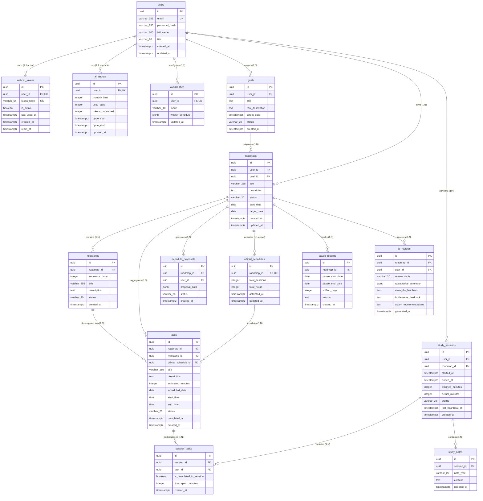

# FocusFlow — Thiết kế Cơ sở Dữ liệu Quan hệ & Sơ đồ Lược đồ (Database Schema Diagram & Design Document)
## Phiên bản: v1.0 — Chuẩn Cơ sở Dữ liệu Vật lý (Physical Database Baseline)
**Dự án:** FocusFlow — Hệ thống hỗ trợ lập kế hoạch và thực thi lộ trình tự học thích ứng tích hợp AI  
**Hệ quản trị CSDL:** PostgreSQL 16  
**Tiêu chuẩn thiết kế:** ISO/IEC 9075 (SQL Standard), Chuẩn hóa 3NF/BCNF, DB Diagram Specification  
**Căn cứ đánh giá học thuật:** Khung Rubric Đồ án Tốt nghiệp CNTT — Tiêu chí TC2.1 & TC2.3 (Mức 5)  
**Tài liệu liên kết:** [`docs/srs/srs-v1.0.md`](file:///Users/vuthang/Documents/FocusFlow/docs/srs/srs-v1.0.md), [`docs/architecture/system-architecture.md`](file:///Users/vuthang/Documents/FocusFlow/docs/architecture/system-architecture.md)

---

## MỤC LỤC

1. [Tổng quan & Phương pháp luận Thiết kế Dữ liệu](#1-tổng-quan--phương-pháp-luận-thiết-kế-dữ-liệu)
   - 1.1 [Yêu cầu từ Giảng viên Hướng dẫn (DB Diagram thay vì Conceptual ERD)](#11-yêu-cầu-từ-giảng-viên-hướng-dẫn-db-diagram-thay-vì-conceptual-erd)
   - 1.2 [Chiến lược Khóa & Quy ước Định danh](#12-chiến-lược-khóa--quy-ước-định-danh)
2. [Sơ đồ Lược đồ Cơ sở Dữ liệu Vật lý (Physical Database Schema Diagram)](#2-sơ-đồ-lược-đồ-cơ-sở-dữ-liệu-vật-lý-physical-database-schema-diagram)
   - 2.1 [Sơ đồ Mermaid Database Schema (Quan hệ Bảng & Kiểu dữ liệu)](#21-sơ-đồ-mermaid-database-schema-quan-hệ-bảng--kiểu-dữ-liệu)
   - 2.2 [Mã nguồn DBML (Database Markup Language cho dbdiagram.io)](#22-mã-nguồn-dbml-database-markup-language-cho-dbdiagramio)
3. [Đặc tả Chi tiết 14 Bảng Dữ liệu & Bảng Liên kết (Physical Tables Specification)](#3-đặc-tả-chi-tiết-14-bảng-dữ-liệu--bảng-liên-kết-physical-tables-specification)
   - 3.1 [Nhóm Người dùng, Xác thực & Hạn ngạch (users, webcal_tokens, ai_quotas)](#31-nhóm-người-dùng-xác-thực--hạn-ngạch-users-webcal_tokens-ai_quotas)
   - 3.2 [Nhóm Cấu hình Thời gian rảnh (availabilities)](#32-nhóm-cấu-hình-thời-gian-rảnh-availabilities)
   - 3.3 [Nhóm Mục tiêu, Lộ trình & Mốc kiến thức (goals, roadmaps, milestones)](#33-nhóm-mục-tiêu-lộ-trình--mốc-kiến-thức-goals-roadmaps-milestones)
   - 3.4 [Nhóm Nhiệm vụ, Đề xuất & Lịch chính thức (tasks, schedule_proposals, official_schedules)](#34-nhóm-nhiệm-vụ-đề-xuất--lịch-chính-thức-tasks-schedule_proposals-official_schedules)
   - 3.5 [Nhóm Thực thi Phiên học & Ghi chép (study_sessions, session_tasks, study_notes)](#35-nhóm-thực-thi-phiên-học--ghi-chép-study_sessions-session_tasks-study_notes)
   - 3.6 [Nhóm Thích ứng & Báo cáo (pause_records, ai_reviews)](#36-nhóm-thích-ứng--báo-cáo-pause_records-ai_reviews)
4. [Phân tích Chuẩn hóa Dữ liệu (Database Normalization Analysis - 3NF / BCNF)](#4-phân-tích-chuẩn-hóa-dữ-liệu-database-normalization-analysis---3nf--bcnf)
5. [Thiết kế Chỉ mục Hiệu năng & Ràng buộc Toàn vẹn (Indexing & Constraints Strategy)](#5-thiết-kế-chỉ-mục-hiệu-năng--ràng-buộc-toàn-vẹn-indexing--constraints-strategy)
   - 5.1 [Chiến lược B-Tree & Partial Indexes](#51-chiến-lược-b-tree--partial-indexes)
   - 5.2 [Ràng buộc Toàn vẹn Tham chiếu (Foreign Key Actions)](#52-ràng-buộc-toàn-vẹn-tham-chiếu-foreign-key-actions)
6. [Quản trị Giao dịch & Khóa Đồng thời (Concurrency & Transactions)](#6-quản-trị-giao-dịch--khóa-đồng-thời-concurrency--transactions)
   - 6.1 [Giao dịch Kích hoạt Lịch Strict Apply (OS-03 Merge Policy)](#61-giao-dịch-kích-hoạt-lịch-strict-apply-os-03-merge-policy)
   - 6.2 [Giao dịch Tịnh tiến Tất định Domino Shift (BUSR-07)](#62-giao-dịch-tịnh-tiến-tất-định-domino-shift-busr-07)
   - 6.3 [Giao dịch Chốt Phiên Gián đoạn (BUSR-09, OS-01, OS-07)](#63-giao-dịch-chốt-phiên-gián-đoạn-busr-09-os-01-os-07)
7. [Tập lệnh SQL DDL Khởi tạo Cơ sở Dữ liệu Hoàn chỉnh (PostgreSQL 16 DDL Script)](#7-tập-lệnh-sql-ddl-khởi-tạo-cơ-sở-dữ-liệu-hoàn-chỉnh-postgresql-16-ddl-script)
8. [Ma trận Truy vết từ Yêu cầu SRS v1.0 sang Cơ sở Dữ liệu](#8-ma-trận-truy-vết-từ-yêu-cầu-srs-v10-sang-cơ-sở-dữ-liệu)

---

## 1. Tổng quan & Phương pháp luận Thiết kế Dữ liệu

### 1.1. Yêu cầu từ Giảng viên Hướng dẫn (DB Diagram thay vì Conceptual ERD)
Theo yêu cầu trực tiếp từ Giảng viên Hướng dẫn Đồ án Tốt nghiệp:
> **Định hướng Học thuật:** Không sử dụng biểu đồ ERD khái niệm hình thoi (Chen notation) mang tính trừu tượng sơ lược. Bắt buộc xây dựng **Sơ đồ Lược đồ Cơ sở Dữ liệu Vật lý (Physical Database Schema Diagram / DB Diagram)** phản ánh chính xác cấu trúc bảng thực tế trong hệ quản trị PostgreSQL 16, thể hiện rõ tên bảng, tên cột, kiểu dữ liệu vật lý chuẩn (`UUID`, `VARCHAR`, `TIMESTAMP WITH TIME ZONE`, `JSONB`, `BOOLEAN`), các chỉ định Khóa chính (`PK`), Khóa ngoại (`FK`), Ràng buộc duy nhất (`UQ`), Ràng buộc kiểm tra (`CHECK`) và các quan hệ 1:1, 1:N, N:M với ký hiệu Crow's Foot chuẩn mực.

### 1.2. Chiến lược Khóa & Quy ước Định danh
* **Chiến lược Khóa chính (Surrogate Key):** Toàn bộ các bảng trong CSDL sử dụng **UUID v4** làm khóa chính (`id UUID PRIMARY KEY DEFAULT uuid_generate_v4()`).
  * *Lý do kỹ thuật:* Ngăn chặn hoàn toàn tấn công vét cạn và đoán định tài nguyên (ID Enumeration Attack) qua REST API; cho phép sinh ID độc lập phía client/worker trước khi lưu xuống CSDL; bảo mật tối đa cho WebCal Token và mã chia sẻ lịch.
* **Quy ước Định danh (Naming Conventions):**
  * Tên bảng: Chữ thường, số nhiều, nối bằng dấu gạch dưới (`snake_case`), ví dụ: `users`, `roadmaps`, `study_sessions`.
  * Tên cột: Chữ thường, `snake_case`, ví dụ: `scheduled_date`, `created_at`.
  * Khóa ngoại: `{tên_bảng_số_ít}_id`, ví dụ: `user_id`, `roadmap_id`, `session_id`.
  * Kiểu thời gian: Luôn sử dụng `TIMESTAMP WITH TIME ZONE` (`TIMESTAMPTZ`) để tránh lệch múi giờ khi người dùng đồng bộ lịch quốc tế hoặc múi giờ Việt Nam (`UTC+7`).
  * Trạng thái (Enum/Status): Sử dụng `VARCHAR(32)` kết hợp ràng buộc `CHECK (status IN (...))` để linh hoạt mở rộng trạng thái mà không gặp rủi ro khóa bảng (Table Lock) như kiểu `CREATE TYPE ... AS ENUM` trong PostgreSQL.

---

## 2. Sơ đồ Lược đồ Cơ sở Dữ liệu Vật lý (Physical Database Schema Diagram)

### 2.1. Sơ đồ Mermaid Database Schema (Quan hệ Bảng & Kiểu dữ liệu)



### 2.2. Mã nguồn DBML (Database Markup Language cho dbdiagram.io)
Sinh viên có thể sao chép đoạn mã DBML dưới đây và dán trực tiếp vào [dbdiagram.io](https://dbdiagram.io) để hiển thị sơ đồ trực quan tương tác:

```dbml
// FocusFlow Physical Database Schema (DBML v1.0)
// Target DBMS: PostgreSQL 16

Table users {
  id uuid [pk, default: `uuid_generate_v4()`]
  email varchar(255) [unique, not null]
  password_hash varchar(255) [not null]
  full_name varchar(100) [not null]
  tier varchar(20) [not null, default: 'FREE', note: 'FREE, PREMIUM']
  created_at timestamptz [not null, default: `now()`]
  updated_at timestamptz [not null, default: `now()`]
}

Table webcal_tokens {
  id uuid [pk, default: `uuid_generate_v4()`]
  user_id uuid [unique, not null, ref: - users.id]
  token_hash varchar(64) [unique, not null, note: '32-byte hex CSPRN']
  is_active boolean [not null, default: true]
  last_used_at timestamptz
  created_at timestamptz [not null, default: `now()`]
  reset_at timestamptz [not null, default: `now()`]
}

Table ai_quotas {
  id uuid [pk, default: `uuid_generate_v4()`]
  user_id uuid [unique, not null, ref: - users.id]
  monthly_limit int [not null, default: 30, note: 'OS-02: Free=30, Premium=300']
  used_calls int [not null, default: 0]
  tokens_consumed int [not null, default: 0]
  cycle_start timestamptz [not null]
  cycle_end timestamptz [not null]
  updated_at timestamptz [not null, default: `now()`]
}

Table availabilities {
  id uuid [pk, default: `uuid_generate_v4()`]
  user_id uuid [unique, not null, ref: - users.id]
  mode varchar(10) [not null, default: 'MODE_A', note: 'MODE_A, MODE_B']
  weekly_schedule jsonb [not null, note: 'Daily bounds per OS-06: 0.5h to 14h']
  updated_at timestamptz [not null, default: `now()`]
}

Table goals {
  id uuid [pk, default: `uuid_generate_v4()`]
  user_id uuid [not null, ref: > users.id]
  title text [not null]
  raw_description text [not null]
  target_date timestamptz
  status varchar(20) [not null, default: 'ACTIVE', note: 'ACTIVE, ARCHIVED']
  created_at timestamptz [not null, default: `now()`]
}

Table roadmaps {
  id uuid [pk, default: `uuid_generate_v4()`]
  user_id uuid [not null, ref: > users.id]
  goal_id uuid [not null, ref: > goals.id]
  title varchar(255) [not null]
  description text
  status varchar(20) [not null, default: 'INITIALIZED', note: 'INITIALIZED, ACTIVE, PAUSED, COMPLETED']
  start_date date
  target_date date
  created_at timestamptz [not null, default: `now()`]
  updated_at timestamptz [not null, default: `now()`]
}

Table milestones {
  id uuid [pk, default: `uuid_generate_v4()`]
  roadmap_id uuid [not null, ref: > roadmaps.id]
  sequence_order int [not null]
  title varchar(255) [not null]
  description text
  status varchar(20) [not null, default: 'PENDING', note: 'PENDING, APPROVED']
  created_at timestamptz [not null, default: `now()`]
}

Table schedule_proposals {
  id uuid [pk, default: `uuid_generate_v4()`]
  roadmap_id uuid [not null, ref: > roadmaps.id]
  user_id uuid [not null, ref: > users.id]
  proposal_data jsonb [not null]
  status varchar(20) [not null, default: 'DRAFT', note: 'DRAFT, APPLIED, DISCARDED']
  created_at timestamptz [not null, default: `now()`]
}

Table official_schedules {
  id uuid [pk, default: `uuid_generate_v4()`]
  roadmap_id uuid [unique, not null, ref: - roadmaps.id]
  total_sessions int [not null, default: 0]
  total_hours int [not null, default: 0]
  activated_at timestamptz [not null, default: `now()`]
  updated_at timestamptz [not null, default: `now()`]
}

Table tasks {
  id uuid [pk, default: `uuid_generate_v4()`]
  roadmap_id uuid [not null, ref: > roadmaps.id]
  milestone_id uuid [not null, ref: > milestones.id]
  official_schedule_id uuid [ref: > official_schedules.id]
  title varchar(255) [not null]
  description text
  estimated_minutes int [not null, note: 'Default 25 to 60 mins']
  scheduled_date date [note: 'NULL indicates Backlog item']
  start_time time
  end_time time
  status varchar(20) [not null, default: 'PENDING', note: 'PENDING, COMPLETED']
  completed_at timestamptz
  created_at timestamptz [not null, default: `now()`]
}

Table study_sessions {
  id uuid [pk, default: `uuid_generate_v4()`]
  user_id uuid [not null, ref: > users.id]
  roadmap_id uuid [not null, ref: > roadmaps.id]
  started_at timestamptz [not null, default: `now()`]
  ended_at timestamptz
  planned_minutes int [not null]
  actual_minutes int [not null, default: 0]
  status varchar(20) [not null, default: 'IN_PROGRESS', note: 'IN_PROGRESS, COMPLETED, PARTIAL_COMPLETED, CANCELLED']
  last_heartbeat_at timestamptz [not null, default: `now()`]
  created_at timestamptz [not null, default: `now()`]
}

Table session_tasks {
  id uuid [pk, default: `uuid_generate_v4()`]
  session_id uuid [not null, ref: > study_sessions.id]
  task_id uuid [not null, ref: > tasks.id]
  is_completed_in_session boolean [not null, default: false]
  time_spent_minutes int [not null, default: 0]
  created_at timestamptz [not null, default: `now()`]
  
  Indexes {
    (session_id, task_id) [unique]
  }
}

Table study_notes {
  id uuid [pk, default: `uuid_generate_v4()`]
  session_id uuid [not null, ref: > study_sessions.id]
  note_type varchar(20) [not null, note: 'SCRATCHPAD, TAKEAWAY']
  content text [not null]
  updated_at timestamptz [not null, default: `now()`]
}

Table pause_records {
  id uuid [pk, default: `uuid_generate_v4()`]
  roadmap_id uuid [not null, ref: > roadmaps.id]
  pause_start_date date [not null]
  pause_end_date date [not null]
  shifted_days int [not null]
  reason text
  created_at timestamptz [not null, default: `now()`]
}

Table ai_reviews {
  id uuid [pk, default: `uuid_generate_v4()`]
  roadmap_id uuid [not null, ref: > roadmaps.id]
  user_id uuid [not null, ref: > users.id]
  review_cycle varchar(20) [not null, note: 'WEEKLY, MILESTONE']
  quantitative_summary jsonb [not null]
  strengths_feedback text [not null]
  bottlenecks_feedback text [not null]
  action_recommendations text [not null]
  generated_at timestamptz [not null, default: `now()`]
}
```

---

## 3. Đặc tả Chi tiết 14 Bảng Dữ liệu & Bảng Liên kết (Physical Tables Specification)

### 3.1. Nhóm Người dùng, Xác thực & Hạn ngạch

#### Bảng `users` (Thông tin tài khoản định danh)
* Mục đích: Lưu trữ tài khoản người dùng, băm mật khẩu bảo mật và phân tầng tài khoản.
* Ánh xạ yêu cầu: `FR-AUTH-001`, `FR-AUTH-002`, `NFR-SEC-002`.

| Tên Cột | Kiểu Dữ liệu Vật lý | Nullable | Mặc định / Ràng buộc | Mô tả & Giải trình Kỹ thuật |
|---|---|---|---|---|
| `id` | `UUID` | No | `uuid_generate_v4()` (PK) | Định danh duy nhất người dùng. |
| `email` | `VARCHAR(255)` | No | `UNIQUE` | Địa chỉ email đăng nhập chuẩn hóa viết thường. |
| `password_hash` | `VARCHAR(255)` | No | | Chuỗi băm mật khẩu bằng thuật toán **Argon2id**. |
| `full_name` | `VARCHAR(100)` | No | | Họ và tên hiển thị của người học. |
| `tier` | `VARCHAR(20)` | No | `'FREE'` / `CHECK (tier IN ('FREE', 'PREMIUM'))` | Phân tầng tài khoản theo `OS-02`. |
| `created_at` | `TIMESTAMPTZ` | No | `NOW()` | Thời điểm khởi tạo tài khoản. |
| `updated_at` | `TIMESTAMPTZ` | No | `NOW()` | Thời điểm cập nhật thông tin gần nhất. |

#### Bảng `webcal_tokens` (Mã bảo mật luồng lịch ngoại vi)
* Mục đích: Quản trị mã bí mật đồng bộ WebCal một chiều với Google/Apple Calendar.
* Ánh xạ yêu cầu: `FR-CALENDAR-002`, `FR-CALENDAR-003`, `BUSR-08`, `NFR-SEC-004`, `OS-05`.

| Tên Cột | Kiểu Dữ liệu Vật lý | Nullable | Mặc định / Ràng buộc | Mô tả & Giải trình Kỹ thuật |
|---|---|---|---|---|
| `id` | `UUID` | No | `uuid_generate_v4()` (PK) | Khóa chính. |
| `user_id` | `UUID` | No | `UNIQUE`, `FK -> users(id) ON DELETE CASCADE` | Quan hệ 1-1 với người dùng. |
| `token_hash` | `VARCHAR(64)` | No | `UNIQUE` | Chuỗi 32-byte hex CSPRN (64 ký tự ngẫu nhiên). |
| `is_active` | `BOOLEAN` | No | `TRUE` | Trạng thái kích hoạt của token. |
| `last_used_at` | `TIMESTAMPTZ` | Yes | `NULL` | Thời điểm ứng dụng lịch ngoại vi kéo dữ liệu gần nhất. |
| `created_at` | `TIMESTAMPTZ` | No | `NOW()` | Thời điểm sinh token. |
| `reset_at` | `TIMESTAMPTZ` | No | `NOW()` | Thời điểm đặt lại token gần nhất (hủy token cũ). |

#### Bảng `ai_quotas` (Quản trị hạn ngạch gọi LLM)
* Mục đích: Giám sát số lượt gọi AI và hạn ngạch hàng tháng để bảo vệ ngân sách.
* Ánh xạ yêu cầu: `FR-QUOTA-001`, `BUSR-10`, `OS-02`.

| Tên Cột | Kiểu Dữ liệu Vật lý | Nullable | Mặc định / Ràng buộc | Mô tả & Giải trình Kỹ thuật |
|---|---|---|---|---|
| `id` | `UUID` | No | `uuid_generate_v4()` (PK) | Khóa chính. |
| `user_id` | `UUID` | No | `UNIQUE`, `FK -> users(id) ON DELETE CASCADE` | Quan hệ 1-1 với người dùng trong chu kỳ. |
| `monthly_limit` | `INTEGER` | No | `30` / `CHECK (monthly_limit > 0)` | Hạn ngạch chu kỳ (Free=30, Premium=300 theo `OS-02`). |
| `used_calls` | `INTEGER` | No | `0` / `CHECK (used_calls >= 0)` | Số lượt gọi AI thành công đã tiêu thụ. |
| `tokens_consumed` | `INTEGER` | No | `0` / `CHECK (tokens_consumed >= 0)` | Tổng số lượng tokens AI đã tiêu thụ. |
| `cycle_start` | `TIMESTAMPTZ` | No | | Thời điểm bắt đầu chu kỳ (ngày 01 hàng tháng). |
| `cycle_end` | `TIMESTAMPTZ` | No | | Thời điểm kết thúc chu kỳ (cuối tháng). |
| `updated_at` | `TIMESTAMPTZ` | No | `NOW()` | Cập nhật thời điểm biến động hạn ngạch. |

---

### 3.2. Nhóm Cấu hình Thời gian rảnh

#### Bảng `availabilities` (Hồ sơ thời gian rảnh của người học)
* Mục đích: Lưu trữ cấu hình thời gian rảnh theo ngày trong tuần phục vụ thuật toán xếp lịch.
* Ánh xạ yêu cầu: `FR-AVAIL-001`, `FR-AVAIL-002`, `BUSR-03`, `BUSR-04`, `OS-06`.

| Tên Cột | Kiểu Dữ liệu Vật lý | Nullable | Mặc định / Ràng buộc | Mô tả & Giải trình Kỹ thuật |
|---|---|---|---|---|
| `id` | `UUID` | No | `uuid_generate_v4()` (PK) | Khóa chính. |
| `user_id` | `UUID` | No | `UNIQUE`, `FK -> users(id) ON DELETE CASCADE` | Quan hệ 1-1 với người dùng. |
| `mode` | `VARCHAR(10)` | No | `'MODE_A'` / `CHECK (mode IN ('MODE_A', 'MODE_B'))` | Chế độ giờ rảnh (Mode A: quỹ giờ, Mode B: khung giờ). |
| `weekly_schedule` | `JSONB` | No | | Cấu hình 7 ngày trong tuần. Ràng buộc cận `0.5h` đến `14h` theo `OS-06`. |
| `updated_at` | `TIMESTAMPTZ` | No | `NOW()` | Thời điểm cập nhật cấu hình thời gian rảnh. |

*Cấu trúc JSONB mẫu cho `weekly_schedule`:*
```json
{
  "monday": {"enabled": true, "quota_hours": 2.0, "time_slots": [{"start": "20:00", "end": "22:00"}]},
  "tuesday": {"enabled": true, "quota_hours": 1.5, "time_slots": [{"start": "20:30", "end": "22:00"}]},
  "wednesday": {"enabled": false, "quota_hours": 0.0, "time_slots": []}
}
```

---

### 3.3. Nhóm Mục tiêu, Lộ trình & Mốc kiến thức

#### Bảng `goals` (Mục tiêu tự học ban đầu)
* Mục đích: Lưu trữ mục tiêu tự học thô do người dùng nhập vào trước khi đối thoại AI.
* Ánh xạ yêu cầu: `FR-GOAL-001`, `FR-GOAL-002`.

| Tên Cột | Kiểu Dữ liệu Vật lý | Nullable | Mặc định / Ràng buộc | Mô tả & Giải trình Kỹ thuật |
|---|---|---|---|---|
| `id` | `UUID` | No | `uuid_generate_v4()` (PK) | Khóa chính. |
| `user_id` | `UUID` | No | `FK -> users(id) ON DELETE CASCADE` | Thuộc sở hữu của User. |
| `title` | `TEXT` | No | | Tên tóm tắt mục tiêu (ví dụ: "Tự học Golang Backend"). |
| `raw_description` | `TEXT` | No | | Văn bản mô tả mục tiêu ban đầu do người dùng nhập. |
| `target_date` | `TIMESTAMPTZ` | Yes | | Hạn chót kỳ vọng hoàn thành mục tiêu. |
| `status` | `VARCHAR(20)` | No | `'ACTIVE'` / `CHECK (status IN ('ACTIVE', 'ARCHIVED'))` | Trạng thái mục tiêu. |
| `created_at` | `TIMESTAMPTZ` | No | `NOW()` | Thời điểm tạo. |

#### Bảng `roadmaps` (Lộ trình học tập tổng thể)
* Mục đích: Quản trị một lộ trình học tập hoàn chỉnh và vòng đời trạng thái của nó.
* Ánh xạ yêu cầu: `FR-PLAN-001`, `FR-PAUSE-001`, Mục 6.1 State Transition.

| Tên Cột | Kiểu Dữ liệu Vật lý | Nullable | Mặc định / Ràng buộc | Mô tả & Giải trình Kỹ thuật |
|---|---|---|---|---|
| `id` | `UUID` | No | `uuid_generate_v4()` (PK) | Khóa chính. |
| `user_id` | `UUID` | No | `FK -> users(id) ON DELETE CASCADE` | Người học sở hữu lộ trình. |
| `goal_id` | `UUID` | No | `FK -> goals(id) ON DELETE RESTRICT` | Mục tiêu gốc sinh ra lộ trình này. |
| `title` | `VARCHAR(255)` | No | | Tên lộ trình hoàn chỉnh sau khi AI chuẩn hóa. |
| `description` | `TEXT` | Yes | | Mô tả tổng quan về lộ trình học. |
| `status` | `VARCHAR(20)` | No | `'INITIALIZED'` / `CHECK (status IN ('INITIALIZED', 'ACTIVE', 'PAUSED', 'COMPLETED'))` | Máy trạng thái vòng đời lộ trình. |
| `start_date` | `DATE` | Yes | | Ngày bắt đầu học thực tế. |
| `target_date` | `DATE` | Yes | | Ngày dự kiến hoàn thành toàn bộ lộ trình. |
| `created_at` | `TIMESTAMPTZ` | No | `NOW()` | Thời điểm tạo lộ trình. |
| `updated_at` | `TIMESTAMPTZ` | No | `NOW()` | Thời điểm cập nhật gần nhất. |

#### Bảng `milestones` (Các mốc kiến thức trung gian - Cấp 1)
* Mục đích: Phân cấp lộ trình thành các chặng kiến thức tuần tự (Cột mốc Cấp 1).
* Ánh xạ yêu cầu: `FR-PLAN-002`, `BUSR-02`.

| Tên Cột | Kiểu Dữ liệu Vật lý | Nullable | Mặc định / Ràng buộc | Mô tả & Giải trình Kỹ thuật |
|---|---|---|---|---|
| `id` | `UUID` | No | `uuid_generate_v4()` (PK) | Khóa chính. |
| `roadmap_id` | `UUID` | No | `FK -> roadmaps(id) ON DELETE CASCADE` | Thuộc về lộ trình nào. |
| `sequence_order` | `INTEGER` | No | `CHECK (sequence_order >= 1)` | Thứ tự tuần tự của mốc kiến thức (1, 2, 3...). |
| `title` | `VARCHAR(255)` | No | | Tiêu đề mốc kiến thức (ví dụ: "Cơ bản về Concurrency"). |
| `description` | `TEXT` | Yes | | Diễn giải chi tiết kiến thức cần đạt được. |
| `status` | `VARCHAR(20)` | No | `'PENDING'` / `CHECK (status IN ('PENDING', 'APPROVED'))` | Trạng thái xem xét của người học. |
| `created_at` | `TIMESTAMPTZ` | No | `NOW()` | Thời điểm khởi tạo. |

---

### 3.4. Nhóm Nhiệm vụ, Đề xuất & Lịch chính thức

#### Bảng `schedule_proposals` (Đề xuất lịch trình tạm thời từ AI)
* Mục đích: Lưu bản đề xuất lịch xem trước từ AI; tuyệt đối không tự ghi đè vào lịch chính thức.
* Ánh xạ yêu cầu: `BUSR-02` (Strict Apply), `OS-03`, Mục 6.4 State Transition.

| Tên Cột | Kiểu Dữ liệu Vật lý | Nullable | Mặc định / Ràng buộc | Mô tả & Giải trình Kỹ thuật |
|---|---|---|---|---|
| `id` | `UUID` | No | `uuid_generate_v4()` (PK) | Khóa chính. |
| `roadmap_id` | `UUID` | No | `FK -> roadmaps(id) ON DELETE CASCADE` | Lộ trình được đề xuất lịch. |
| `user_id` | `UUID` | No | `FK -> users(id) ON DELETE CASCADE` | Người dùng sở hữu đề xuất. |
| `proposal_data` | `JSONB` | No | | Toàn bộ danh sách task dự thảo và ngày đề xuất từ LLM. |
| `status` | `VARCHAR(20)` | No | `'DRAFT'` / `CHECK (status IN ('DRAFT', 'APPLIED', 'DISCARDED'))` | Vòng đời đề xuất theo Mục 6.4 SRS. |
| `created_at` | `TIMESTAMPTZ` | No | `NOW()` | Thời điểm AI sinh đề xuất. |

#### Bảng `official_schedules` (Lịch trình học chính thức hợp lệ)
* Mục đích: Đại diện cho lịch học tập chính thức đã được kích hoạt thành công qua Validation Gate.
* Ánh xạ yêu cầu: `FR-PLAN-003`, `BUSR-02`, `BUSR-03`.

| Tên Cột | Kiểu Dữ liệu Vật lý | Nullable | Mặc định / Ràng buộc | Mô tả & Giải trình Kỹ thuật |
|---|---|---|---|---|
| `id` | `UUID` | No | `uuid_generate_v4()` (PK) | Khóa chính. |
| `roadmap_id` | `UUID` | No | `UNIQUE`, `FK -> roadmaps(id) ON DELETE CASCADE` | Mỗi Roadmap tại một thời điểm chỉ có 1 Official Schedule. |
| `total_sessions` | `INTEGER` | No | `0` | Tổng số buổi học đã được lên lịch. |
| `total_hours` | `INTEGER` | No | `0` | Tổng số giờ học dự kiến toàn bộ lộ trình. |
| `activated_at` | `TIMESTAMPTZ` | No | `NOW()` | Thời điểm người dùng bấm nút Apply qua Gate. |
| `updated_at` | `TIMESTAMPTZ` | No | `NOW()` | Thời điểm cập nhật lại lịch (sau dời lịch hoặc merge). |

#### Bảng `tasks` (Đầu việc chi tiết - Cấp 2)
* Mục đích: Quản lý từng nhiệm vụ học tập cụ thể, thời lượng dự kiến và ngày lên lịch thực tế.
* Ánh xạ yêu cầu: `FR-TASK-001`, `FR-ADAPT-001`, `BUSR-06`, Mục 6.2 State Transition.

| Tên Cột | Kiểu Dữ liệu Vật lý | Nullable | Mặc định / Ràng buộc | Mô tả & Giải trình Kỹ thuật |
|---|---|---|---|---|
| `id` | `UUID` | No | `uuid_generate_v4()` (PK) | Khóa chính. |
| `roadmap_id` | `UUID` | No | `FK -> roadmaps(id) ON DELETE CASCADE` | Thuộc Roadmap nào. |
| `milestone_id` | `UUID` | No | `FK -> milestones(id) ON DELETE CASCADE` | Thuộc mốc kiến thức nào. |
| `official_schedule_id` | `UUID` | Yes | `FK -> official_schedules(id) ON DELETE SET NULL` | Thuộc lịch chính thức nào (nếu `NULL` là task trong Backlog). |
| `title` | `VARCHAR(255)` | No | | Tên nhiệm vụ cụ thể (ví dụ: "Đọc tài liệu Goroutines"). |
| `description` | `TEXT` | Yes | | Hướng dẫn chi tiết hoặc tài liệu tham khảo đính kèm. |
| `estimated_minutes` | `INTEGER` | No | `CHECK (estimated_minutes BETWEEN 15 AND 240)` | Thời lượng ước tính (15 đến 240 phút). |
| `scheduled_date` | `DATE` | Yes | | Ngày học cụ thể (`NULL` = Backlog chưa xếp lịch). |
| `start_time` | `TIME` | Yes | | Giờ bắt đầu (nếu cấu hình Mode B). |
| `end_time` | `TIME` | Yes | | Giờ kết thúc (nếu cấu hình Mode B). |
| `status` | `VARCHAR(20)` | No | `'PENDING'` / `CHECK (status IN ('PENDING', 'COMPLETED'))` | Trạng thái thực hiện bền vững. |
| `completed_at` | `TIMESTAMPTZ` | Yes | | Thời điểm tick hoàn thành task. |
| `created_at` | `TIMESTAMPTZ` | No | `NOW()` | Thời điểm tạo task. |

> [!NOTE]
> **Quy tắc Nghiệp vụ `BUSR-06` về Trạng thái Quá hạn (OVERDUE):**  
> Trạng thái `OVERDUE` không được lưu cứng trong cột `status`. Nó là một điều kiện tính toán suy diễn (Derived Attribute): `status = 'PENDING' AND scheduled_date < CURRENT_DATE`.

---

### 3.5. Nhóm Thực thi Phiên học & Ghi chép

#### Bảng `study_sessions` (Phiên học tập trung trong Study Workspace)
* Mục đích: Quản trị một buổi học Pomodoro/Stopwatch cụ thể, thời gian thực học và nhịp tim.
* Ánh xạ yêu cầu: `FR-SESSION-001..003`, `BUSR-09`, `OS-01`, `OS-07`, Mục 6.3 State Transition.

| Tên Cột | Kiểu Dữ liệu Vật lý | Nullable | Mặc định / Ràng buộc | Mô tả & Giải trình Kỹ thuật |
|---|---|---|---|---|
| `id` | `UUID` | No | `uuid_generate_v4()` (PK) | Khóa chính phiên học. |
| `user_id` | `UUID` | No | `FK -> users(id) ON DELETE CASCADE` | Người học thực hiện phiên. |
| `roadmap_id` | `UUID` | No | `FK -> roadmaps(id) ON DELETE CASCADE` | Phiên học thuộc lộ trình nào. |
| `started_at` | `TIMESTAMPTZ` | No | `NOW()` | Thời điểm bắt đầu bấm giờ phiên học. |
| `ended_at` | `TIMESTAMPTZ` | Yes | | Thời điểm kết thúc phiên học (hoặc thời điểm chốt do timeout). |
| `planned_minutes` | `INTEGER` | No | `CHECK (planned_minutes > 0)` | Thời lượng dự tính ban đầu (ví dụ: 60 phút). |
| `actual_minutes` | `INTEGER` | No | `0` / `CHECK (actual_minutes >= 0)` | Thời gian thực học thực tế (tính đến nhịp tim cuối). |
| `status` | `VARCHAR(20)` | No | `'IN_PROGRESS'` / `CHECK (status IN ('IN_PROGRESS', 'COMPLETED', 'PARTIAL_COMPLETED', 'CANCELLED'))` | Trạng thái phiên học theo `OS-01`. |
| `last_heartbeat_at` | `TIMESTAMPTZ` | No | `NOW()` | Thời điểm client gửi ping nhịp tim gần nhất (`OS-07`). |
| `created_at` | `TIMESTAMPTZ` | No | `NOW()` | Thời điểm khởi tạo bản ghi. |

#### Bảng `session_tasks` (Bảng liên kết Nhiều-Nhiều giữa Phiên học và Nhiệm vụ)
* Mục đích: Cho phép một phiên học chọn nhiều task, hoặc một task được học trong nhiều phiên; ghi nhận task hoàn thành trong phiên.
* Ánh xạ yêu cầu: `FR-SESSION-002`, `BUSR-09`.

| Tên Cột | Kiểu Dữ liệu Vật lý | Nullable | Mặc định / Ràng buộc | Mô tả & Giải trình Kỹ thuật |
|---|---|---|---|---|
| `id` | `UUID` | No | `uuid_generate_v4()` (PK) | Khóa chính. |
| `session_id` | `UUID` | No | `FK -> study_sessions(id) ON DELETE CASCADE` | Khóa ngoại tới phiên học. |
| `task_id` | `UUID` | No | `FK -> tasks(id) ON DELETE CASCADE` | Khóa ngoại tới nhiệm vụ. |
| `is_completed_in_session` | `BOOLEAN` | No | `FALSE` | Đánh dấu task đã được tick xong ngay trong phiên học này. |
| `time_spent_minutes` | `INTEGER` | No | `0` | Số phút phân bổ cụ thể cho task này trong phiên. |
| `created_at` | `TIMESTAMPTZ` | No | `NOW()` | Thời điểm gán task vào phiên. |

*Ràng buộc duy nhất:* `UNIQUE (session_id, task_id)` ngăn chặn gán trùng task vào cùng một phiên học.

#### Bảng `study_notes` (Ghi chép trong không gian học)
* Mục đích: Lưu trữ bản nháp tức thời (*Scratchpad*) và đúc kết cuối buổi (*Key Takeaways*).
* Ánh xạ yêu cầu: `FR-SESSION-002`, `NFR-UX-001`.

| Tên Cột | Kiểu Dữ liệu Vật lý | Nullable | Mặc định / Ràng buộc | Mô tả & Giải trình Kỹ thuật |
|---|---|---|---|---|
| `id` | `UUID` | No | `uuid_generate_v4()` (PK) | Khóa chính. |
| `session_id` | `UUID` | No | `FK -> study_sessions(id) ON DELETE CASCADE` | Ghi chú gắn với phiên học nào. |
| `note_type` | `VARCHAR(20)` | No | `CHECK (note_type IN ('SCRATCHPAD', 'TAKEAWAY'))` | Phân loại ghi chú (Nháp tự do hoặc Đúc kết). |
| `content` | `TEXT` | No | `''` | Nội dung văn bản ghi chép của người học. |
| `updated_at` | `TIMESTAMPTZ` | No | `NOW()` | Thời điểm cập nhật nội dung gần nhất. |

---

### 3.6. Nhóm Thích ứng & Báo cáo

#### Bảng `pause_records` (Lịch sử tạm dừng lộ trình)
* Mục đích: Lưu trữ các khoảng thời gian người học tạm dừng học tập và số ngày đã tịnh tiến dời lịch.
* Ánh xạ yêu cầu: `FR-PAUSE-001`, `FR-PAUSE-002`, `BUSR-07`, `KPI 3 (EVAL-03)`.

| Tên Cột | Kiểu Dữ liệu Vật lý | Nullable | Mặc định / Ràng buộc | Mô tả & Giải trình Kỹ thuật |
|---|---|---|---|---|
| `id` | `UUID` | No | `uuid_generate_v4()` (PK) | Khóa chính. |
| `roadmap_id` | `UUID` | No | `FK -> roadmaps(id) ON DELETE CASCADE` | Lộ trình được tạm dừng. |
| `pause_start_date` | `DATE` | No | | Ngày bắt đầu tạm dừng lộ trình. |
| `pause_end_date` | `DATE` | No | | Ngày kết thúc tạm dừng (ngày học trở lại). |
| `shifted_days` | `INTEGER` | No | `CHECK (shifted_days > 0)` | Số ngày lịch trình đã bị tịnh tiến lùi lại về sau. |
| `reason` | `TEXT` | Yes | | Lý do tạm dừng (ví dụ: "Bận thi học kỳ", "Ốm"). |
| `created_at` | `TIMESTAMPTZ` | No | `NOW()` | Thời điểm ghi nhận lệnh tạm dừng. |

*Ràng buộc logic:* `CHECK (pause_end_date >= pause_start_date)`.

#### Bảng `ai_reviews` (Báo cáo & Nhận xét định kỳ từ AI)
* Mục đích: Lưu trữ nhận xét định tính của AI dựa trên số liệu thực học và Key Takeaways.
* Ánh xạ yêu cầu: `FR-REPORT-001`, `FR-REPORT-002`, `NFR-SEC-003`.

| Tên Cột | Kiểu Dữ liệu Vật lý | Nullable | Mặc định / Ràng buộc | Mô tả & Giải trình Kỹ thuật |
|---|---|---|---|---|
| `id` | `UUID` | No | `uuid_generate_v4()` (PK) | Khóa chính. |
| `roadmap_id` | `UUID` | No | `FK -> roadmaps(id) ON DELETE CASCADE` | Lộ trình được đánh giá. |
| `user_id` | `UUID` | No | `FK -> users(id) ON DELETE CASCADE` | Người học nhận đánh giá. |
| `review_cycle` | `VARCHAR(20)` | No | `CHECK (review_cycle IN ('WEEKLY', 'MILESTONE'))` | Chu kỳ đánh giá (Hàng tuần hoặc Sau mỗi cột mốc). |
| `quantitative_summary` | `JSONB` | No | | Số liệu toán học đã được làm sạch (Số giờ học, tỷ lệ hoàn thành). |
| `strengths_feedback` | `TEXT` | No | | Nhận xét điểm mạnh và thành tựu đã đạt được. |
| `bottlenecks_feedback` | `TEXT` | No | | Cảnh báo điểm nghẽn, các task trễ hạn hoặc học dở dang. |
| `action_recommendations` | `TEXT` | No | | Đề xuất hành động điều chỉnh cụ thể cho chu kỳ tiếp theo. |
| `generated_at` | `TIMESTAMPTZ` | No | `NOW()` | Thời điểm AI sinh nhận xét. |

---

## 4. Phân tích Chuẩn hóa Dữ liệu (Database Normalization Analysis - 3NF / BCNF)

Hệ thống FocusFlow được thiết kế bảo đảm đạt **Dạng Chuẩn 3 (3NF)** và **Chuẩn Boyce-Codd (BCNF)** toàn diện:

1. **Dạng chuẩn 1 (1NF - First Normal Form):**
   * Mọi thuộc tính trong các bảng đều có tính nguyên tử (Atomic Values). Không có các cột mảng đa trị lặp lại lồng nhau (Repeating Groups). 
   * Trường `weekly_schedule` trong `availabilities` và `proposal_data` trong `schedule_proposals` sử dụng kiểu `JSONB` của PostgreSQL để lưu tài liệu có cấu trúc linh hoạt theo đúng chuẩn Document Store, nhưng các khóa tìm kiếm và quan hệ thực thể cốt lõi (`tasks`, `milestones`, `sessions`) đều được phân rã thành các bảng quan hệ riêng biệt.
2. **Dạng chuẩn 2 (2NF - Second Normal Form):**
   * Mọi bảng đều có Khóa chính duy nhất là Surrogate Key (`id UUID`). 
   * Do khóa chính là đơn thuộc tính (Single-column PK), mọi thuộc tính không khóa đều phụ thuộc hàm toàn phần (Full Functional Dependency) vào khóa chính, hoàn toàn không có phụ thuộc một phần (Partial Dependency).
3. **Dạng chuẩn 3 (3NF - Third Normal Form):**
   * Không có bất kỳ thuộc tính không khóa nào phụ thuộc bắc cầu (Transitive Dependency) vào khóa chính:
     * Ví dụ: Trong bảng `tasks`, thông tin chi tiết của mốc kiến thức (như `milestone_title`, `sequence_order`) không được lưu lặp lại trong `tasks`, mà chỉ lưu khóa ngoại `milestone_id`.
     * Trong bảng `study_sessions`, tổng thời gian học của toàn bộ lộ trình không được lưu dư thừa trong từng phiên học, mà được tính toán tổng hợp (Aggregation) khi cần hoặc cập nhật có chủ đích tại `official_schedules`.
4. **Dạng chuẩn Boyce-Codd (BCNF):**
   * Mọi phụ thuộc hàm $X \to Y$ có ý nghĩa trong hệ thống thì $X$ đều là một Siêu khóa (Superkey / Candidate Key) của bảng.

---

## 5. Thiết kế Chỉ mục Hiệu năng & Ràng buộc Toàn vẹn (Indexing & Constraints Strategy)

### 5.1. Chiến lược B-Tree & Partial Indexes
Nhằm đáp ứng yêu cầu `NFR-PERF-002` (API phản hồi $\le 200$ms cho 20 concurrent users), các chỉ mục (Indexes) được thiết kế có chủ đích bám sát các mẫu truy vấn (Query Patterns) thực tế:

```sql
-- 1. Tối ưu hóa truy vấn đăng nhập & xác thực
CREATE UNIQUE INDEX idx_users_email ON users(email);

-- 2. Tối ưu hóa truy vấn xác thực WebCal Feed (Tra cứu theo chuỗi token cực nhanh)
CREATE UNIQUE INDEX idx_webcal_tokens_token_hash ON webcal_tokens(token_hash) WHERE is_active = TRUE;

-- 3. Tối ưu hóa truy vấn tác vụ theo ngày của người học (Lịch trình Kanban / Calendar view)
CREATE INDEX idx_tasks_roadmap_scheduled_date ON tasks(roadmap_id, scheduled_date);

-- 4. Tối ưu hóa truy vấn phát hiện tác vụ quá hạn tất định (BUSR-06)
-- Partial Index: Chỉ lập chỉ mục các task chưa xong và có ngày lên lịch
CREATE INDEX idx_tasks_pending_overdue ON tasks(scheduled_date) 
WHERE status = 'PENDING' AND scheduled_date IS NOT NULL;

-- 5. Tối ưu hóa truy vấn kiểm tra nhịp tim phiên học của Celery Worker (OS-07)
-- Partial Index: Chỉ quét các phiên học đang diễn ra
CREATE INDEX idx_study_sessions_in_progress ON study_sessions(last_heartbeat_at) 
WHERE status = 'IN_PROGRESS';

-- 6. Tối ưu hóa truy vấn đếm hạn ngạch gọi AI trong chu kỳ
CREATE INDEX idx_ai_quotas_user_cycle ON ai_quotas(user_id, cycle_start, cycle_end);
```

### 5.2. Ràng buộc Toàn vẹn Tham chiếu (Foreign Key Actions)
* **Xóa theo tầng (`ON DELETE CASCADE`):** Áp dụng cho các quan hệ sở hữu phụ thuộc (Composition): Khi xóa 1 `User`, toàn bộ `roadmaps`, `availabilities`, `study_sessions`, `ai_quotas` liên quan sẽ tự động bị xóa sạch, bảo vệ tính sạch sẽ của CSDL và tuân thủ quyền được quên (Right to be Forgotten). Tương tự, khi xóa 1 `Roadmap`, các `milestones`, `tasks`, `pause_records` bị xóa theo.
* **Chặn xóa (`ON DELETE RESTRICT`):** Áp dụng cho `goals -> roadmaps`: Không cho phép xóa một mục tiêu (`Goal`) nếu mục tiêu đó đã sinh ra các lộ trình học tập đang hoạt động (`Roadmap`), bảo đảm tính toàn vẹn nguồn gốc truy vết.
* **Gán `NULL` (`ON DELETE SET NULL`):** Áp dụng cho `official_schedules -> tasks`: Khi một lịch chính thức bị xóa hoặc lưu trữ, các task chưa học không bị xóa mà được chuyển về trạng thái `official_schedule_id = NULL` để người dùng tái sử dụng trong Backlog.

---

## 6. Quản trị Giao dịch & Khóa Đồng thời (Concurrency & Transactions)

### 6.1. Giao dịch Kích hoạt Lịch Strict Apply (OS-03 Merge Policy)
Khi người dùng bấm nút [Apply Lịch], hệ thống bắt buộc thực thi trong một Database Transaction duy nhất ở mức cô lập **Read Committed** với khóa hàng (Row-level Lock):

```sql
BEGIN TRANSACTION;
  -- 1. Khóa bản ghi Roadmap để ngăn chặn việc bấm Apply đồng thời từ 2 tab
  SELECT id FROM roadmaps WHERE id = :roadmap_id FOR UPDATE;

  -- 2. Áp dụng chính sách Merge (OS-03): Xóa các task chưa học trong tương lai của lịch cũ
  DELETE FROM tasks 
  WHERE roadmap_id = :roadmap_id 
    AND status = 'PENDING' 
    AND scheduled_date >= CURRENT_DATE;

  -- 3. Tạo mới hoặc cập nhật Official Schedule
  INSERT INTO official_schedules (roadmap_id, total_sessions, total_hours, activated_at)
  VALUES (:roadmap_id, :total_sessions, :total_hours, NOW())
  ON CONFLICT (roadmap_id) DO UPDATE 
  SET total_sessions = EXCLUDED.total_sessions,
      total_hours = EXCLUDED.total_hours,
      updated_at = NOW();

  -- 4. Chèn hàng loạt (Batch Insert) các task mới từ Proposal
  INSERT INTO tasks (roadmap_id, milestone_id, official_schedule_id, title, estimated_minutes, scheduled_date, start_time, end_time, status)
  VALUES (...);

  -- 5. Đánh dấu Schedule Proposal đã được áp dụng
  UPDATE schedule_proposals SET status = 'APPLIED' WHERE id = :proposal_id;
  
  -- 6. Cập nhật trạng thái Roadmap sang ACTIVE
  UPDATE roadmaps SET status = 'ACTIVE', updated_at = NOW() WHERE id = :roadmap_id;
COMMIT;
```

### 6.2. Giao dịch Tịnh tiến Tất định Domino Shift (BUSR-07)
Khi người học tạm dừng lộ trình, toàn bộ lịch trình tương lai được dời lùi trong một phép toán nguyên tử:

```sql
BEGIN TRANSACTION;
  -- 1. Lưu bản ghi tạm dừng
  INSERT INTO pause_records (roadmap_id, pause_start_date, pause_end_date, shifted_days, reason)
  VALUES (:roadmap_id, :start_date, :end_date, :N_days, :reason);

  -- 2. Dời tịnh tiến N ngày cho toàn bộ task chưa hoàn thành tính từ ngày tạm dừng
  UPDATE tasks
  SET scheduled_date = scheduled_date + (:N_days * INTERVAL '1 day')
  WHERE roadmap_id = :roadmap_id
    AND status = 'PENDING'
    AND scheduled_date >= :start_date;

  -- 3. Cập nhật trạng thái Roadmap thành PAUSED
  UPDATE roadmaps SET status = 'PAUSED', updated_at = NOW() WHERE id = :roadmap_id;
COMMIT;
```

### 6.3. Giao dịch Chốt Phiên Gián đoạn (BUSR-09, OS-01, OS-07)
Do Celery Worker thực thi định kỳ mỗi 5 phút:

```sql
BEGIN TRANSACTION;
  -- Quét và khóa phiên học quá hạn heartbeat 5 phút
  SELECT id, planned_minutes, actual_minutes 
  FROM study_sessions 
  WHERE status = 'IN_PROGRESS' 
    AND last_heartbeat_at < NOW() - INTERVAL '5 minutes'
  FOR UPDATE SKIP LOCKED;

  -- Áp dụng quy tắc OS-01:
  -- Nếu actual_minutes >= planned_minutes * 0.5 HOẶC có >= 1 task COMPLETED -> PARTIAL_COMPLETED
  -- Ngược lại -> CANCELLED
  UPDATE study_sessions
  SET status = CASE 
      WHEN actual_minutes >= (planned_minutes * 0.5) THEN 'PARTIAL_COMPLETED'
      WHEN EXISTS (SELECT 1 FROM session_tasks WHERE session_id = study_sessions.id AND is_completed_in_session = TRUE) THEN 'PARTIAL_COMPLETED'
      ELSE 'CANCELLED'
  END,
  ended_at = last_heartbeat_at
  WHERE id = :session_id;
COMMIT;
```

---

## 7. Tập lệnh SQL DDL Khởi tạo Cơ sở Dữ liệu Hoàn chỉnh (PostgreSQL 16 DDL Script)

Tệp mã nguồn SQL DDL chuẩn hóa, sẵn sàng khởi tạo schema trong PostgreSQL 16:

```sql
-- =============================================================================
-- FocusFlow Relational Database Schema DDL (PostgreSQL 16)
-- Generated: 29/09/2026
-- =============================================================================

-- Kích hoạt tiện ích mở rộng sinh UUID v4
CREATE EXTENSION IF NOT EXISTS "uuid-ossp";

-- -----------------------------------------------------------------------------
-- 1. BẢNG USERS
-- -----------------------------------------------------------------------------
CREATE TABLE users (
    id UUID PRIMARY KEY DEFAULT uuid_generate_v4(),
    email VARCHAR(255) NOT NULL UNIQUE,
    password_hash VARCHAR(255) NOT NULL,
    full_name VARCHAR(100) NOT NULL,
    tier VARCHAR(20) NOT NULL DEFAULT 'FREE' CHECK (tier IN ('FREE', 'PREMIUM')),
    created_at TIMESTAMPTZ NOT NULL DEFAULT NOW(),
    updated_at TIMESTAMPTZ NOT NULL DEFAULT NOW()
);

-- -----------------------------------------------------------------------------
-- 2. BẢNG WEBCAL_TOKENS
-- -----------------------------------------------------------------------------
CREATE TABLE webcal_tokens (
    id UUID PRIMARY KEY DEFAULT uuid_generate_v4(),
    user_id UUID NOT NULL UNIQUE REFERENCES users(id) ON DELETE CASCADE,
    token_hash VARCHAR(64) NOT NULL UNIQUE,
    is_active BOOLEAN NOT NULL DEFAULT TRUE,
    last_used_at TIMESTAMPTZ,
    created_at TIMESTAMPTZ NOT NULL DEFAULT NOW(),
    reset_at TIMESTAMPTZ NOT NULL DEFAULT NOW()
);

-- -----------------------------------------------------------------------------
-- 3. BẢNG AI_QUOTAS
-- -----------------------------------------------------------------------------
CREATE TABLE ai_quotas (
    id UUID PRIMARY KEY DEFAULT uuid_generate_v4(),
    user_id UUID NOT NULL UNIQUE REFERENCES users(id) ON DELETE CASCADE,
    monthly_limit INTEGER NOT NULL DEFAULT 30 CHECK (monthly_limit > 0),
    used_calls INTEGER NOT NULL DEFAULT 0 CHECK (used_calls >= 0),
    tokens_consumed INTEGER NOT NULL DEFAULT 0 CHECK (tokens_consumed >= 0),
    cycle_start TIMESTAMPTZ NOT NULL,
    cycle_end TIMESTAMPTZ NOT NULL,
    updated_at TIMESTAMPTZ NOT NULL DEFAULT NOW()
);

-- -----------------------------------------------------------------------------
-- 4. BẢNG AVAILABILITIES
-- -----------------------------------------------------------------------------
CREATE TABLE availabilities (
    id UUID PRIMARY KEY DEFAULT uuid_generate_v4(),
    user_id UUID NOT NULL UNIQUE REFERENCES users(id) ON DELETE CASCADE,
    mode VARCHAR(10) NOT NULL DEFAULT 'MODE_A' CHECK (mode IN ('MODE_A', 'MODE_B')),
    weekly_schedule JSONB NOT NULL,
    updated_at TIMESTAMPTZ NOT NULL DEFAULT NOW()
);

-- -----------------------------------------------------------------------------
-- 5. BẢNG GOALS
-- -----------------------------------------------------------------------------
CREATE TABLE goals (
    id UUID PRIMARY KEY DEFAULT uuid_generate_v4(),
    user_id UUID NOT NULL REFERENCES users(id) ON DELETE CASCADE,
    title TEXT NOT NULL,
    raw_description TEXT NOT NULL,
    target_date TIMESTAMPTZ,
    status VARCHAR(20) NOT NULL DEFAULT 'ACTIVE' CHECK (status IN ('ACTIVE', 'ARCHIVED')),
    created_at TIMESTAMPTZ NOT NULL DEFAULT NOW()
);

-- -----------------------------------------------------------------------------
-- 6. BẢNG ROADMAPS
-- -----------------------------------------------------------------------------
CREATE TABLE roadmaps (
    id UUID PRIMARY KEY DEFAULT uuid_generate_v4(),
    user_id UUID NOT NULL REFERENCES users(id) ON DELETE CASCADE,
    goal_id UUID NOT NULL REFERENCES goals(id) ON DELETE RESTRICT,
    title VARCHAR(255) NOT NULL,
    description TEXT,
    status VARCHAR(20) NOT NULL DEFAULT 'INITIALIZED' 
        CHECK (status IN ('INITIALIZED', 'ACTIVE', 'PAUSED', 'COMPLETED')),
    start_date DATE,
    target_date DATE,
    created_at TIMESTAMPTZ NOT NULL DEFAULT NOW(),
    updated_at TIMESTAMPTZ NOT NULL DEFAULT NOW()
);

-- -----------------------------------------------------------------------------
-- 7. BẢNG MILESTONES
-- -----------------------------------------------------------------------------
CREATE TABLE milestones (
    id UUID PRIMARY KEY DEFAULT uuid_generate_v4(),
    roadmap_id UUID NOT NULL REFERENCES roadmaps(id) ON DELETE CASCADE,
    sequence_order INTEGER NOT NULL CHECK (sequence_order >= 1),
    title VARCHAR(255) NOT NULL,
    description TEXT,
    status VARCHAR(20) NOT NULL DEFAULT 'PENDING' CHECK (status IN ('PENDING', 'APPROVED')),
    created_at TIMESTAMPTZ NOT NULL DEFAULT NOW()
);

-- -----------------------------------------------------------------------------
-- 8. BẢNG SCHEDULE_PROPOSALS
-- -----------------------------------------------------------------------------
CREATE TABLE schedule_proposals (
    id UUID PRIMARY KEY DEFAULT uuid_generate_v4(),
    roadmap_id UUID NOT NULL REFERENCES roadmaps(id) ON DELETE CASCADE,
    user_id UUID NOT NULL REFERENCES users(id) ON DELETE CASCADE,
    proposal_data JSONB NOT NULL,
    status VARCHAR(20) NOT NULL DEFAULT 'DRAFT' CHECK (status IN ('DRAFT', 'APPLIED', 'DISCARDED')),
    created_at TIMESTAMPTZ NOT NULL DEFAULT NOW()
);

-- -----------------------------------------------------------------------------
-- 9. BẢNG OFFICIAL_SCHEDULES
-- -----------------------------------------------------------------------------
CREATE TABLE official_schedules (
    id UUID PRIMARY KEY DEFAULT uuid_generate_v4(),
    roadmap_id UUID NOT NULL UNIQUE REFERENCES roadmaps(id) ON DELETE CASCADE,
    total_sessions INTEGER NOT NULL DEFAULT 0 CHECK (total_sessions >= 0),
    total_hours INTEGER NOT NULL DEFAULT 0 CHECK (total_hours >= 0),
    activated_at TIMESTAMPTZ NOT NULL DEFAULT NOW(),
    updated_at TIMESTAMPTZ NOT NULL DEFAULT NOW()
);

-- -----------------------------------------------------------------------------
-- 10. BẢNG TASKS
-- -----------------------------------------------------------------------------
CREATE TABLE tasks (
    id UUID PRIMARY KEY DEFAULT uuid_generate_v4(),
    roadmap_id UUID NOT NULL REFERENCES roadmaps(id) ON DELETE CASCADE,
    milestone_id UUID NOT NULL REFERENCES milestones(id) ON DELETE CASCADE,
    official_schedule_id UUID REFERENCES official_schedules(id) ON DELETE SET NULL,
    title VARCHAR(255) NOT NULL,
    description TEXT,
    estimated_minutes INTEGER NOT NULL CHECK (estimated_minutes BETWEEN 15 AND 240),
    scheduled_date DATE,
    start_time TIME,
    end_time TIME,
    status VARCHAR(20) NOT NULL DEFAULT 'PENDING' CHECK (status IN ('PENDING', 'COMPLETED')),
    completed_at TIMESTAMPTZ,
    created_at TIMESTAMPTZ NOT NULL DEFAULT NOW()
);

-- -----------------------------------------------------------------------------
-- 11. BẢNG STUDY_SESSIONS
-- -----------------------------------------------------------------------------
CREATE TABLE study_sessions (
    id UUID PRIMARY KEY DEFAULT uuid_generate_v4(),
    user_id UUID NOT NULL REFERENCES users(id) ON DELETE CASCADE,
    roadmap_id UUID NOT NULL REFERENCES roadmaps(id) ON DELETE CASCADE,
    started_at TIMESTAMPTZ NOT NULL DEFAULT NOW(),
    ended_at TIMESTAMPTZ,
    planned_minutes INTEGER NOT NULL CHECK (planned_minutes > 0),
    actual_minutes INTEGER NOT NULL DEFAULT 0 CHECK (actual_minutes >= 0),
    status VARCHAR(20) NOT NULL DEFAULT 'IN_PROGRESS' 
        CHECK (status IN ('IN_PROGRESS', 'COMPLETED', 'PARTIAL_COMPLETED', 'CANCELLED')),
    last_heartbeat_at TIMESTAMPTZ NOT NULL DEFAULT NOW(),
    created_at TIMESTAMPTZ NOT NULL DEFAULT NOW()
);

-- -----------------------------------------------------------------------------
-- 12. BẢNG SESSION_TASKS
-- -----------------------------------------------------------------------------
CREATE TABLE session_tasks (
    id UUID PRIMARY KEY DEFAULT uuid_generate_v4(),
    session_id UUID NOT NULL REFERENCES study_sessions(id) ON DELETE CASCADE,
    task_id UUID NOT NULL REFERENCES tasks(id) ON DELETE CASCADE,
    is_completed_in_session BOOLEAN NOT NULL DEFAULT FALSE,
    time_spent_minutes INTEGER NOT NULL DEFAULT 0 CHECK (time_spent_minutes >= 0),
    created_at TIMESTAMPTZ NOT NULL DEFAULT NOW(),
    CONSTRAINT uq_session_task UNIQUE (session_id, task_id)
);

-- -----------------------------------------------------------------------------
-- 13. BẢNG STUDY_NOTES
-- -----------------------------------------------------------------------------
CREATE TABLE study_notes (
    id UUID PRIMARY KEY DEFAULT uuid_generate_v4(),
    session_id UUID NOT NULL REFERENCES study_sessions(id) ON DELETE CASCADE,
    note_type VARCHAR(20) NOT NULL CHECK (note_type IN ('SCRATCHPAD', 'TAKEAWAY')),
    content TEXT NOT NULL DEFAULT '',
    updated_at TIMESTAMPTZ NOT NULL DEFAULT NOW()
);

-- -----------------------------------------------------------------------------
-- 14. BẢNG PAUSE_RECORDS
-- -----------------------------------------------------------------------------
CREATE TABLE pause_records (
    id UUID PRIMARY KEY DEFAULT uuid_generate_v4(),
    roadmap_id UUID NOT NULL REFERENCES roadmaps(id) ON DELETE CASCADE,
    pause_start_date DATE NOT NULL,
    pause_end_date DATE NOT NULL,
    shifted_days INTEGER NOT NULL CHECK (shifted_days > 0),
    reason TEXT,
    created_at TIMESTAMPTZ NOT NULL DEFAULT NOW(),
    CONSTRAINT chk_pause_dates CHECK (pause_end_date >= pause_start_date)
);

-- -----------------------------------------------------------------------------
-- 15. BẢNG AI_REVIEWS
-- -----------------------------------------------------------------------------
CREATE TABLE ai_reviews (
    id UUID PRIMARY KEY DEFAULT uuid_generate_v4(),
    roadmap_id UUID NOT NULL REFERENCES roadmaps(id) ON DELETE CASCADE,
    user_id UUID NOT NULL REFERENCES users(id) ON DELETE CASCADE,
    review_cycle VARCHAR(20) NOT NULL CHECK (review_cycle IN ('WEEKLY', 'MILESTONE')),
    quantitative_summary JSONB NOT NULL,
    strengths_feedback TEXT NOT NULL,
    bottlenecks_feedback TEXT NOT NULL,
    action_recommendations TEXT NOT NULL,
    generated_at TIMESTAMPTZ NOT NULL DEFAULT NOW()
);

-- =============================================================================
-- TỐI ƯU HÓA CHỈ MỤC HIỆU NĂNG (INDEXES)
-- =============================================================================
CREATE UNIQUE INDEX idx_webcal_tokens_token_hash ON webcal_tokens(token_hash) WHERE is_active = TRUE;
CREATE INDEX idx_tasks_roadmap_scheduled_date ON tasks(roadmap_id, scheduled_date);
CREATE INDEX idx_tasks_pending_overdue ON tasks(scheduled_date) WHERE status = 'PENDING' AND scheduled_date IS NOT NULL;
CREATE INDEX idx_study_sessions_in_progress ON study_sessions(last_heartbeat_at) WHERE status = 'IN_PROGRESS';
CREATE INDEX idx_ai_quotas_user_cycle ON ai_quotas(user_id, cycle_start, cycle_end);
CREATE INDEX idx_milestones_roadmap_seq ON milestones(roadmap_id, sequence_order);
CREATE INDEX idx_study_notes_session ON study_notes(session_id);
```

---

## 8. Ma trận Truy vết từ Yêu cầu SRS v1.0 sang Cơ sở Dữ liệu

| Thực thể Logic SRS v1.0 | Bảng Cơ sở Dữ liệu Vật lý | Khóa chính / Phụ thuộc | Ràng buộc Kỹ thuật & BUSR Chi phối |
|---|---|---|---|
| **User** | `users` | `id UUID` (PK) | `FR-AUTH-001`, `BUSR-01`: Email Unique, Argon2id. |
| **WebCal Token** | `webcal_tokens` | `id UUID` (PK), `user_id` (FK 1:1) | `FR-CALENDAR-002`, `BUSR-08`, `OS-05`: 32-byte hex CSPRN. |
| **AI Quota & Usage** | `ai_quotas` | `id UUID` (PK), `user_id` (FK 1:1) | `FR-QUOTA-001`, `BUSR-10`, `OS-02`: Free=30, Premium=300. |
| **Availability** | `availabilities` | `id UUID` (PK), `user_id` (FK 1:1) | `FR-AVAIL-001..002`, `BUSR-03..04`, `OS-06`: Cận 0.5h-14h. |
| **Goal** | `goals` | `id UUID` (PK), `user_id` (FK 1:N) | `FR-GOAL-001..002`: Nguồn gốc sinh lộ trình. |
| **Roadmap** | `roadmaps` | `id UUID` (PK), `goal_id` (FK 1:N) | `FR-PLAN-001`, `BUSR-01`: Trạng thái INITIALIZED->ACTIVE->PAUSED->COMPLETED. |
| **Milestone** | `milestones` | `id UUID` (PK), `roadmap_id` (FK 1:N) | `FR-PLAN-002`, `BUSR-02`: sequence_order >= 1. |
| **Schedule Proposal** | `schedule_proposals` | `id UUID` (PK), `roadmap_id` (FK 1:N) | `BUSR-02` (Strict Apply): ProposalData JSONB, status DRAFT. |
| **Official Schedule** | `official_schedules` | `id UUID` (PK), `roadmap_id` (FK 1:1) | `FR-PLAN-003`, `BUSR-02`: Bảng chính thức sau Validation Gate. |
| **Task** | `tasks` | `id UUID` (PK), `roadmap_id`, `milestone_id` (FK) | `FR-TASK-001`, `BUSR-06`: Overdue là derived condition. |
| **Study Session** | `study_sessions` | `id UUID` (PK), `user_id`, `roadmap_id` (FK) | `FR-SESSION-001..003`, `BUSR-09`, `OS-01`, `OS-07`: Heartbeat & Partial status. |
| *(Liên kết Session - Task)* | `session_tasks` | `id UUID` (PK), `session_id`, `task_id` (FK) | `FR-SESSION-002`: Giải quyết quan hệ N:M giữa Session và Tasks. |
| **Study Note** | `study_notes` | `id UUID` (PK), `session_id` (FK 1:N) | `FR-SESSION-002`: SCRATCHPAD và TAKEAWAY. |
| **Pause Record** | `pause_records` | `id UUID` (PK), `roadmap_id` (FK 1:N) | `FR-PAUSE-001..002`, `BUSR-07`: shifted_days > 0, tịnh tiến lịch. |
| **AI Review & Report** | `ai_reviews` | `id UUID` (PK), `roadmap_id`, `user_id` (FK) | `FR-REPORT-001..002`, `NFR-SEC-003`: Báo cáo toán học + AI feedback. |
